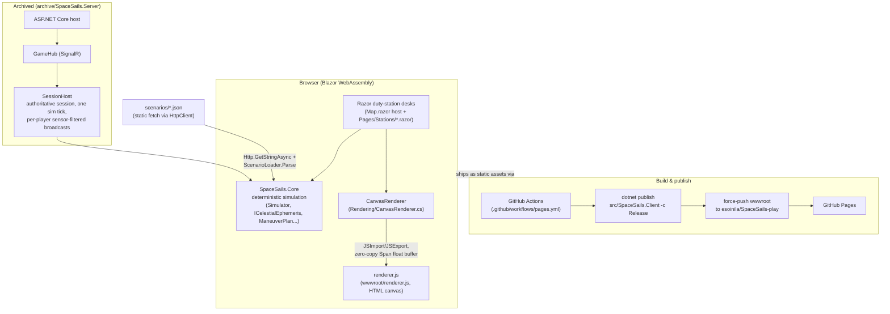

# Architecture

This is the box view of SpaceSails: what runs where, why it's shaped this way, and where it
might grow. Written for people and AI landing in the repo cold — cite the files, not just the
diagram.

## Box view

Three projects carry the weight (`SpaceSails.slnx`):

- **`src/SpaceSails.Core`** — the deterministic simulator (`Simulator.cs`, `ShipState.cs`,
  `ManeuverPlan.cs`, `CircularOrbitEphemeris.cs`, `PathPredictor.cs`, `TrafficSchedule.cs`,
  `NewsWire.cs`, `DeterministicRandom.cs`, and friends). No UI, no I/O beyond
  `ScenarioLoader.LoadFile`, no wall clock. This project is the whole point of the shared-Core
  design — see [Why WebAssembly](#why-webassembly) below.
- **`src/SpaceSails.Contracts`** — DTOs and scenario models (`Scenario.cs`,
  `Multiplayer.cs`) shared by anything that talks to Core or the (archived) hub.
- **`src/SpaceSails.Client`** — the Blazor WASM app. `Pages/Map.razor` is the single host page
  (`@page "/map"`): it owns the `<canvas>`, the desk tab bar, keyboard shortcuts, and drives
  `Core.Simulator` directly in-process. `Rendering/CanvasRenderer.cs` implements `IRenderer`
  over that canvas; `Rendering/RendererInterop.cs` is the `[JSImport]`/`[JSExport]` boundary to
  `wwwroot/renderer.js`, chosen specifically so the per-frame vertex buffer crosses as a
  zero-copy `JSType.MemoryView` over a `Span<float>` instead of a JSON-serialized array — the
  interop budget is two calls per frame (`drawFrame` + `drawTexts`), not one per primitive.

Scenarios (`scenarios/sol.json`, `scenarios/wheel.json`, `scenarios/sol-eu.json`) are the
canonical copy at the repo root. `SpaceSails.Client.csproj`'s `CopyScenariosIntoWwwroot` MSBuild
target mirrors them into `wwwroot/scenarios` before static-web-asset discovery runs (a plain
linked `<Content>` item resolves fine at build time but 200s with a zero-length body at request
time under the dev server — the copy sidesteps that). `Map.razor` fetches them at runtime with
`Http.GetStringAsync($"scenarios/{scenarioName}.json")` and hands the JSON to
`ScenarioLoader.Parse`; the `?scenario=` query string picks which file.

The publish pipeline (`.github/workflows/pages.yml`) runs `dotnet publish
src/SpaceSails.Client -c Release`, patches `index.html` for the `SpaceSails-play` subpath and
cache-busts the stylesheets, then force-pushes `publish/wwwroot` as the entire `main` branch of
the public `esoinila/SpaceSails-play` repo, which serves GitHub Pages from it. The source repo
stays private; the built repo is the only public artifact. See
[archive/README.md](../archive/README.md) for why it's a force-push to a separate repo rather
than Pages-from-this-repo (Pages doesn't serve private repos on the plan this project is on).

The archived path — `archive/SpaceSails.Server` (`GameHub.cs`, `SessionHost.cs`) — is an
ASP.NET Core host that serves the same client plus a SignalR hub over an authoritative
`SessionHost`. It isn't part of the default build or CI; see
[archive/README.md](../archive/README.md) for what's there and how to bring it back.

## The duty-station UI architecture

The client is one live simulation viewed through full-screen "desks," not a dashboard of
panels. `Pages/ShipDesk.cs` is the enum (`Nav`, `Sensors`, `WarRoom`, `Trade`, `Comms`,
`Galley`, `Deck`, `Captain`); `Map.razor` is the single host that switches which desk's content
fills the screen, keeps the canvas and `Core.Simulator` running underneath regardless of which
desk is active, and renders a thin edge strip of `DeskChips.razor` — one small,
standardized objective-summary chip per *other* desk (`Pages/Stations/DeskChips.razor`).

The shape follows one rule from the owner (`docs/SaturdayPlan/StationDesks.md`): **the 70%
rule** — at each station, that station's own topic should own roughly 70% of the screen.
Sensors shows a full scope wall (one live scope per tracked target simultaneously, not a small
box); War room gets the full tactical circle; Trade gets local space and the dock market side
by side. Everything that isn't the current desk's topic is reduced to a one-line chip
("`→ Mars orbit`", "`heat 🔥N · hunter 2.1 Mkm`", "no whispers") — info-rich where it's owned,
summary everywhere else. This is why the older design of small pop-up cards stacked over the
map (traffic board, dock panel, first-hunt banner) was retired in favor of desks switched by
number key (`1`-`7`, `0` for Captain) or a tab bar: cramming a scope wall or a tactical circle
into a floating card left no room to actually read it. See
[docs/features/station-desks.md](features/station-desks.md) for the desk-by-desk detail.

## Multiplayer with the desk system

This is a design discussion, not a build sheet — nothing here is implemented.

The archived server (`archive/SpaceSails.Server/SessionHost.cs`) already solved the hard parts
of one flavor of multiplayer: one authoritative session, one sim tick, 2-8 pirates. Two
properties carry over directly:

- **Min-warp voting** — `SessionHost` advances time at the minimum of all connected players'
  requested warp; nobody can skip time a crewmate hasn't agreed to.
- **Per-player sensor-filtered broadcasts** — each player's state packet is filtered through the
  same `SensorModel` the single-player client already uses, from that player's own ship
  position. An unobserved ship is simply absent from the packet, not present-but-masked.

The desk refit changes what "multiplayer" most naturally means, though. The old model was
**ship-per-player**: each pirate flies their own hull in a shared system. The desk system
suggests a second, arguably more natural mode on top of it: **crew multiplayer** — several
players on *one* ship, each permanently manning a different desk. A captain holds the mission
(key `0`, `Pages/Stations/Captain.razor`) and sets the goal; someone else runs Sensors
(`TrackingPost.razor`) and calls out tracks; someone runs War room
(`WarRoom.razor`) and handles hails/bribes/warning shots; someone flies Nav. This maps the
existing desk boundaries onto player boundaries almost for free — the summary-chip strip
already exists to tell everyone what the other stations are doing, which is exactly the
information a real crewmate would want from a crewmate's station.

Ship-per-player (today's archived mode) would remain the second tier: useful for a fleet-vs-fleet
or race scenario where players don't share a hull, but not the first mode to build, since crew
multiplayer reuses the desk boundaries that already exist and ship-per-player mostly reuses the
old `SessionHost`/`GameHub` machinery as-is.

What would need to be server-authoritative vs. what can stay client-side, in either mode:

- **Server-authoritative:** the shared sim tick and time (nobody's local clock decides what
  happened), maneuver plans and pulses (so two crewmates can't issue conflicting burns), cargo
  and credits (the stakes), anything hidden-information (sensor visibility, dark-web intel) —
  the existing `SessionHost` broadcast filtering is designed exactly for this.
- **Client-side:** desk UI state (which desk *you* personally are looking at is purely local —
  a captain and a sensors officer are on different desks of the same ship at the same moment),
  rendering, camera/follow-ship, and anything cosmetic (news wire flavor, the rum locker/wobble
  — though shared-ship rum state is a fun edge case for crew mode specifically, since one
  crewmate's wobble arguably shouldn't be everyone's wobble).

The reason this is cheap either way: `SpaceSails.Core` is deterministic (`Simulator.cs`'s own
doc comment: "the same initial state, plan, and step count must produce bit-identical results
on client (WASM) and server"). That means state sync is **inputs and seeds, not snapshots** —
a server (or a peer) only needs to forward the maneuver plan changes, pulse commands, and the
`DeterministicRandom` seed for anything randomized (traffic generation), and every client
re-derives the same world by replaying the same deterministic Core. This is dramatically
cheaper than shipping full `ShipState` snapshots per tick, and it's the same property the
archived server already leaned on.

## Why WebAssembly

`SpaceSails.Core` is a plain .NET class library referenced by both the WASM client
(`SpaceSails.Client.csproj`) and, when resurrected, the ASP.NET server
(`archive/SpaceSails.Server`) — one integrator, one source of truth for orbital mechanics,
traffic, and encounter rules, running unmodified on both sides. That's the actual reason for
choosing Blazor WebAssembly over, say, a JS/canvas frontend talking to a thin API: the
simulation itself ships as browser code, not just a client for someone else's simulation.

Two more properties fall out of that choice:

- **Near-native speed for the integrator.** WASM's AOT/JIT path runs the fixed-timestep
  semi-implicit Euler integrator (`Simulator.Step`) fast enough for real-time play at high warp.
  The honest caveat, learned the hard way and now called out in the README: **Debug builds run
  on the WASM IL interpreter and are roughly 100x slower** — choppy frames and sluggish
  plotting. `-c Release` is mandatory for anything resembling real play; `run.ps1` defaults to
  it and `run-debug.ps1` exists specifically to make the slower, debuggable path opt-in rather
  than the default.
- **Zero-server static hosting.** Because the whole client is static WASM/JS/CSS output, it
  ships as files, not a running process — `.github/workflows/pages.yml` publishes and
  force-pushes the build to `esoinila/SpaceSails-play`, which GitHub Pages serves directly.
  Free, scales without attention, no ops to run or pay for. This is also *why* the source repo
  stays private while the build artifact is a separate public repo: GitHub Pages needs a public
  repo to serve from, and the built output (not the source) is what's meant to be public.

Two hosting pitfalls this project actually hit, both from static WASM publish's asset-fingerprinting
model:

- **Fingerprinted framework assets.** .NET 10 renames `_framework/*.js` on every build,
  so a browser can end up requesting an index.html that no longer matches a stale
  service-worker/cache entry, or vice versa — the fix in practice is just restarting the local
  dev server and reloading (documented in the README's tips).
- **Scoped CSS's hash mismatch (the "postage-stamp-map incident").** Standalone WASM publish
  only fingerprints `_framework` assets, not the scoped-CSS bundle
  (`SpaceSails.Client.styles.css`) or `bootstrap.min.css`. The scoped-CSS bundle's `b-xxx`
  scope attributes are regenerated per build, so a browser-cached stale stylesheet served
  against fresh DLLs silently drops all scoped styles — the map shrank to a postage stamp with
  no visible error. `pages.yml` works around this by appending a per-build query string
  (`?v=<short-sha>`) to each stylesheet link in the published `index.html`, forcing a fresh
  fetch every deploy instead of relying on fingerprinting that standalone WASM publish doesn't
  do for these files.
