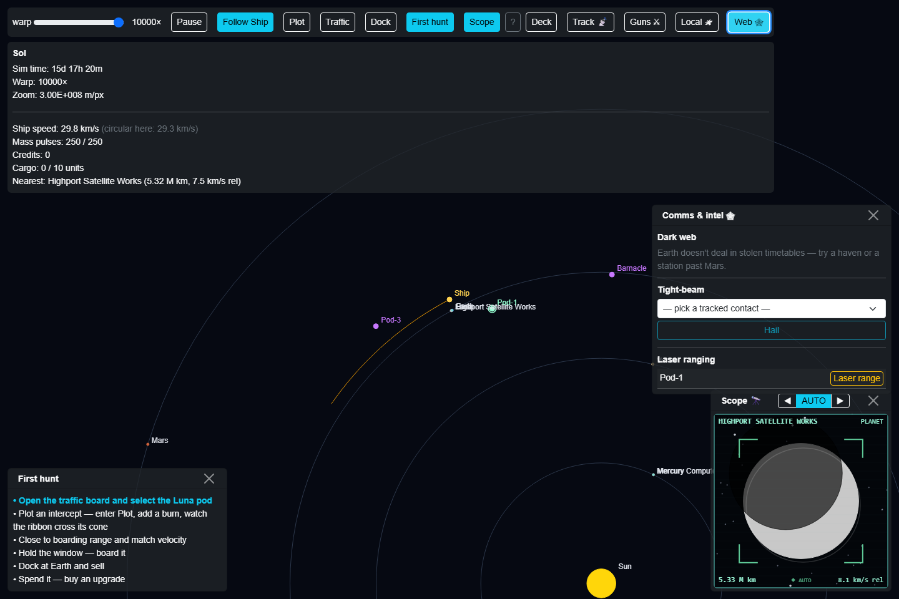

# Dark space web

What this is: the outer reaches' black market for information — buy route intel on ships that
don't publish a timetable, sell your own [tracking post](tracking-post.md) finds, hail a tracked
contact directly, or burn a laser fix on one at the cost of giving away your own position.

Where: press the **Web 🕸** toolbar button on the map. The dark-web (buy/sell) section only works
while you're docked or bound in orbit somewhere `IntelMarket.CanTradeIntelAt` allows — see below;
tight-beam and laser ranging work anywhere.

## Where you can trade intel

Route intel only changes hands at:

- **Any pirate haven**, or
- **Any station** farther from the sun than **4×10¹¹ m** — a "far trading post", the same
  central-space/outer-reaches split the traffic schedule uses internally for long-haul routes
  (between Mars's orbit and Jupiter's).

Ordinary planets never trade intel, haven flag or not — Earth, Mars, and Venus stay legitimate.
Central-space stations (compute farms, satellite works close to the inner planets) don't deal in
stolen timetables either; the trade needs the outer reaches' anonymity. If you're not somewhere
that qualifies, the panel shows why instead of a market.

## Buying and selling

- **Buying**: off-the-books ships (`PublishesTimetable == false`) the market currently knows about
  are listed with callsign, route, cargo. Price is
  `(300 + cargoValue × 0.4) × DistanceFactor(distanceFromEarth)`, where `DistanceFactor` clamps
  between 0.3 and 3 — **farther from Earth is cheaper**: the outer reaches trade in secrets as a
  matter of course, while the same tip commands a premium near Earth. A bought tip is valid for
  **30 sim-days** before it goes stale; buying an already-known ship again just refreshes it.
  Bought intel injects the ship straight onto your own [traffic board](traffic-board.md), tagged
  with a **🕸 stale in Nd** badge counting down to expiry.
- **Selling**: any of your own tracking-post finds at **≥50% quality** can be fenced here for
  `quality × cargoValue × 0.3`. Selling never removes the track from your ledger — information
  copies, it isn't spent — so a good find is repeatable income, not a one-shot cash-out.

## Tight-beam hailing

Pick a tracked contact from the dropdown and **Hail** it — a directed point-to-point link, not a
broadcast, with a **5×10¹⁰ m** range limit. A ship that publishes its timetable answers honestly
("Bound for *destination*, over."); a secretive one gives nothing ("No flight plan filed.").
Out of range gets a curt "out of tight-beam range" instead.

## Laser ranging — the price of a perfect fix

**Laser range** any tracked contact for an exact, zero-age position and velocity fix — no range
limit of its own (you can only aim it at something you've already found). The cost: it's active,
and it **flags your position** — the target (and anyone else watching) now knows roughly where the
shot came from. The panel confirms this bluntly: *"Laser ranged \<callsign\> — exact fix, but
you're lit up ⚠"*. The pinged ship shows an **aware ⚠** tag back on the [tracking post](tracking-post.md)'s
ledger.

Passive scanning (sweeping with the telescope) never gives you away — that's the pirate's way.
Tight-beam and laser ranging are the two deliberate exceptions, used when the payoff (a clean fix,
an honest answer) is worth being seen.

See also: [tracking-post.md](tracking-post.md) for how a target gets onto your ledger in the first
place, [traffic-board.md](traffic-board.md) for the off-the-books footer bought intel fills in,
[local-space.md](local-space.md) for trading cargo (as opposed to information) at the same kind of
stop, [war-room.md](war-room.md) for what "lit up" can eventually cost you.
