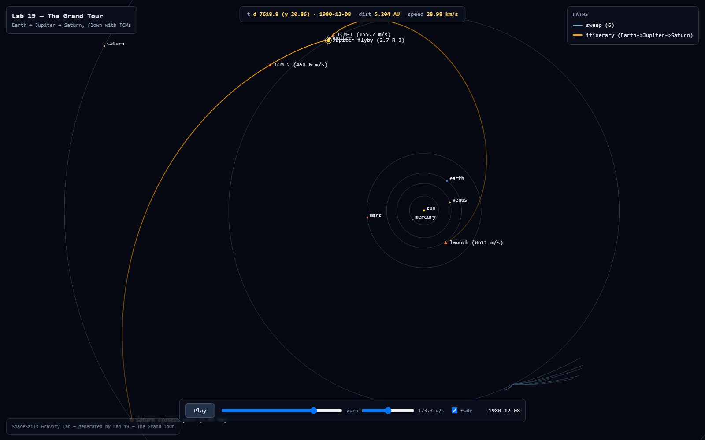
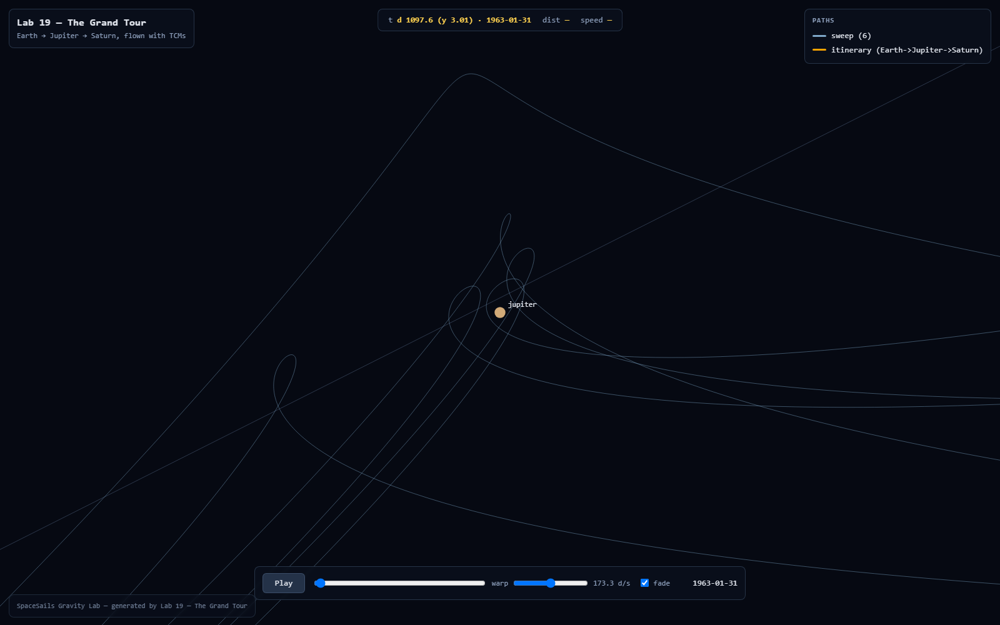

# Lab viz

What this is: an optional browser pop-up for the [Gravity Lab](../../labs/README.md) lessons. Run
a lesson from the command line as always, get its printed tables, and — if you ask for it — also
get a picture of the trajectories the probe just computed, drawn in the game's own visual
language.

Where: append `-- --viz` to a supporting lesson's run command. It writes a single self-contained
HTML file under `labviz/` and opens it in your default browser:

```bash
dotnet run --project labs/19-the-grand-tour -c Release -- --viz
```

The file is completely offline — no CDN scripts, no web fonts, no network requests of any kind —
so it opens the same on a plane as on your desk, and you can hand it to someone as a single
attachment. Lessons 01 and 19 support it today; more will follow.


*Lesson 19: the flown Earth→Jupiter→Saturn itinerary with its burn and flyby markers, ghost ship
parked at the flyby, live readout above.*

## What the viewer can do

- **Pan and zoom** — drag to slide the camera, wheel to zoom toward the cursor, with the same
  meters-per-pixel feel as the game map. It opens framed on the whole trajectory.
- **Time scrub and play** — a timeline slider with play/pause and a speed control walks a **ghost
  ship** dot along the flown path, with the bodies moving on their orbits underneath it. A readout
  strip shows the sim date, the ship's distance from the Sun in AU, and its speed in km/s.
- **Bodies on rails** — planets and moons ride their circular orbit rings, drawn as discs with
  labels, exactly where the lesson's own ephemeris puts them.
- **Legend groups** — trajectories are grouped and listed in a legend; click a group to toggle it.
  Lesson 19's fan of aim-offset test flights is one such group, so you can show or hide the whole
  sweep at once.
- **Markers** — burns, flybys, and closest passes get distinct glyphs and labels that stay legible
  at any zoom, so the story's turning points are called out on the picture.
- **Time fade** — a ghost path fades with time distance from the scrub cursor: the past dims as
  it ages, the far future stays a faint plan, and the segment being flown right now is at full
  strength. This is what visually untangles a decades-long trajectory that loops over itself
  (lesson 20's long coast). Non-ghost path families (lesson 19's sweep fan — alternate flights,
  not a timeline) stay flat. A `fade` checkbox in the controls turns it off entirely.


*Zoomed on lesson 19's sweep group: the aim-offset test flights hairpin around Jupiter in the
heliocentric frame — the gravity-assist "crank" made visible.*

## The honesty rule

The lab's whole brand is that every printed number came from actually running the lesson's probe,
and the picture keeps that promise: it is drawn *from those same numbers* — the trajectory
polylines are the integrator's own steps, not an idealized sketch. The viz is post-hoc and
strictly additive. Without `--viz`, a lesson's stdout is byte-identical to before, so the numbers
the READMEs quote never move because a picture got added.

Handy flags: `--viz-no-open` writes the file without launching a browser; `--viz-out=<path>`
chooses where it lands.

See also: [labs/README.md](../../labs/README.md) for the lesson index and the ~six-line pattern for
wiring a new lesson, and `docs/lab-viz-spec.md` for the internals (the camera math, the scene JSON
schema, and the ephemeris-parity test that keeps the picture honest).
