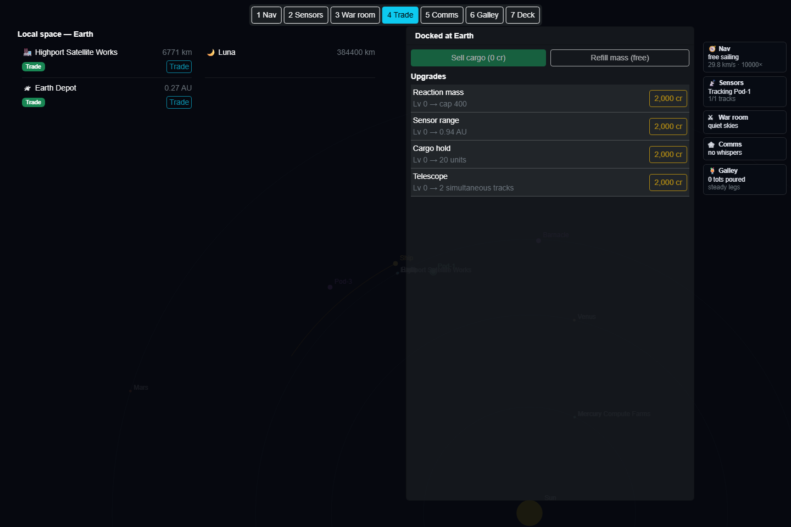

# Local space

What this is: "orbiting a planet, you should see what else orbits there" — a panel listing every
depot, station, moon, haven, and nearby ship at whatever body you're currently bound to (or
cruising close to), plus a one-click drone trade with anything that'll take one.

Where: the **Trade desk** — press `4` or click **4 Trade** in the station tab bar (see
[station-desks.md](station-desks.md)). Full-screen, alongside the dock market. As of PR-11 it no
longer auto-opens on binding to orbit (a full-screen desk switch would be too disruptive
mid-flight) — the Trade summary chip on other desks updates live instead.

## The trading rule

Trading (with anyone, anywhere) requires one of two things, per `CommerceRule`:

- **Same-orbit trading** — you and the counterpart are bound to the same body: the classic bus
  stop, parked at a depot, station, or haven.
- **Course-matched trading** — absent that, you're within **500,000 km** and under **2 km/s**
  relative speed of a moving partner. That's the same distance envelope as the boarding shuttle's
  capture window but a *looser* speed limit (2 km/s vs. boarding's 5 km/s is actually tighter —
  cooperative cargo drones don't need the shuttle's tolerance for a fleeing, uncooperative target,
  so the game only asks for an already-decent match).

## Drone transfers

Once trading's allowed, selling your hold isn't instant — a cargo-drone transfer takes real time,
shown as a striped progress bar reading **"Drones ferrying — NN%"**. Base rate is **20 seconds per
cargo unit** at a perfect, point-blank match; relative speed and distance each add time on top (the
required time grows further past 2,500 m/s of mismatch or 5×10⁸ m of standoff — both gentler
penalties than the boarding shuttle's own math, since a cooperative partner is helping, not
running). Progress accrues in real time — warp doesn't fast-forward it — and there's no partial
credit: drift out of the envelope mid-transfer (burn away, fall out of orbit) and the progress is
lost.

Trading through this panel sells your *entire* current cargo hold at the same prices as the
[dock](dock-and-economy.md) — it's a second path to the same sale, not a different market.

## The contact list

Each row shows an icon by kind, distance, and action badges:

| Icon | Kind | Badges |
|---|---|---|
| 🛰 | Depot | Trade (+ Fence, if the depot's body is a haven) |
| 🏭 | Station | Trade |
| 🌙 | Moon | *(none — moons are scenery unless flagged a haven)* |
| 🏴 | Haven | Trade, Fence |
| 🚀 | Ship | Board |

A **Trade** button appears next to anything tagged `Trade`, disabled unless you're actually
carrying cargo and the trading rule above is satisfied — hover it for why it's greyed out
("Out of range — get in orbit here or match course"). Boardable ships show a **Board** badge only
— boarding itself still runs through the ordinary [traffic board](traffic-board.md)/
[boarding-run](boarding-run.md) flow, this panel just tells you a ship is close enough to try.

Depots, stations, and havens carry no real gravity in scenario data (`mu: 0`), so instead of a
Hill-sphere check they use a fixed **2×10⁷ m** "dockyard" radius to decide what counts as local —
comfortably wider than a station's own depot orbit.

## On the map itself

Anything this panel lists that's co-orbiting your current body also gets a subtle extra ring drawn
around its marker on the map — the same proximity affordance made visible where you're actually
looking, not just in the side panel.

See also: [dock-and-economy.md](dock-and-economy.md) for the port-zone dock flow (the other way to
sell), [depots.md](depots.md) for the plunderable orbital depots this panel also lists,
[dark-web.md](dark-web.md) for trading intel at a haven or far station instead of cargo,
[war-room.md](war-room.md) for what happens when a "Board" badge turns into a robbery.
