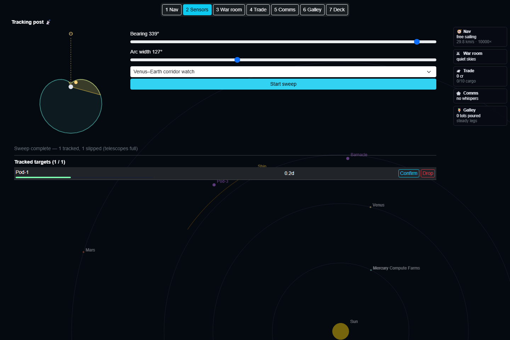

# Tracking post

What this is: the ship's telescope station — aim it at a patch of sky, sweep it over sim time,
and hold a ledger of ships that don't publish a timetable (the secretive He3 haulers and anyone
else the [traffic board](traffic-board.md) can't already tell you about).

Where: the **Sensors desk** — press `2` or click **2 Sensors** in the station tab bar (see
[station-desks.md](station-desks.md)). Full-screen, not a pop-up card.

## The sun-blind rosette

The card's left side draws a small egg-shaped "rosette" around your ship: how far the telescope
can see, by look direction, relative to the sun. Detection range follows a cosine ramp between two
extremes:

- Pointed **straight at the sun** — near-blind, only **8%** of base range (glare swamps
  everything but the brightest returns).
- Pointed **straight away from the sun** (anti-sunward) — full base range, the pirate's best
  hunting angle: dark sky, targets lit from behind you.

Base range is **6.0×10¹¹ m** — about six times the ship's passive proximity sensor — but only
along the telescope's aimed bearing; sweep somewhere useless and you see nothing no matter how far
away a target sits. The wedge overlaid on the rosette shows your current aim; any tracked contact
appears as a colored dot at its true bearing and range fraction (green = solid lock, amber = fair,
red = fading).

## Sweeping

Set a **bearing** (0–359°) and an **arc width** (5–360°) with the two sliders. (The old
corridor-watch dropdown retired in the Sunday-second chain: trade lanes are now clickable
regions on the map itself — see [sensors-map.md](sensors-map.md).)

Click **Start sweep**. Sweeping isn't instant: a full 360° survey takes **6 sim-hours**, so a
narrow wedge finishes faster than a wide one (time scales linearly with arc width). A progress bar
tracks it; **Stop sweep** aborts early. When it completes, every candidate whose bearing falls
inside the wedge and whose distance is within the telescope's sun-relative range at that bearing
gets detected and added to the ledger.

> **Superseded note (Sunday-second chain):** the wall below was collapsed to a single cycling
> tile in M27, then reborn in PR-D as **one live scope box inside every track card**, with the
> one-telescope **Sensor tasks** queue running custody passes automatically. Current behavior
> is specified in [sensors-map.md](sensors-map.md); the section below is kept for the design
> history.

## The scope wall (PR-12)

The owner's brief was blunt: *"for space telescopy the specialist position could show all the
targets not just one at the same time."* So the Sensors desk's main area is a **scope wall** — one
live scope tile per tracked target, all rendered simultaneously (up to 4, one per telescope
upgrade level), instead of a single small inset with a separate summary table.

Each tile is a real [`ScopeView`](../../src/SpaceSails.Client/Rendering/ScopeView.cs) canvas — the
same vector-art instrument Nav's own scope inset uses (auto-lit target, lock brackets, starfield
parallax, plasma wisps) — aimed permanently at that one ledger entry, redrawn every animation
frame off the shared render loop. Below the canvas, a footer strip carries what the art can't:

- **Callsign** (plus an **aware ⚠** tag if you've laser-ranged it from the [dark web](dark-web.md)).
- A **quality bar** — the same 0-100% confidence the ledger has always tracked.
- **Days since last confirm**, and current **distance**.
- **Confirm** (a short, cheap re-look at the target's predicted position) and **Drop** buttons,
  right on the tile — no separate table to scroll to.

An empty slot (telescope count not yet full of tracks) shows a dark, dashed "no track — sweep to
acquire" tile instead of a target — the wall always shows exactly as many tiles as your telescope
can hold, whether or not they're all filled.

## Keeping a lock

Once a sweep finds a ship, keeping the lock is cheap:

- A brand-new track starts at **40% quality**.
- **Confirm** does a short, cheap re-look at the target's *predicted* position (dead-reckoned
  forward from the last observation) rather than a fresh full sweep — succeeds only if the target
  is still inside its predicted uncertainty cone and within telescope range, and bumps quality by
  **+35%** (capped at 100%) on success. A target that burned hard enough to leave the cone slips
  the re-acquire — go sweep again.
- Left unconfirmed past **5 days**, quality decays **20%/day** beyond that horizon. Below **5%**
  quality the entry drops off the ledger entirely — the contact is lost for good until a fresh
  sweep finds it again, and its wall tile goes back to "no track — sweep to acquire".
- **Drop** removes an entry manually (e.g. to free a slot for a higher-value contact).

## Telescope count — the upgrade axis

How many ships you can hold on the ledger at once (**MaxTracks**) is a permanent upgrade bought at
the dock alongside reaction mass, sensor range, and cargo hold — see
[dock-and-economy.md](dock-and-economy.md). Level 0 holds 1 track; each level adds one more, up to
4 simultaneous tracks at max level. Trying to add a new contact past the cap fails outright — drop
something or upgrade first.

## Emphasis on the nav map

A tracked ship renders brighter on the map itself, with a small uncertainty ring around it sized
off the same growth formula the [traffic board](traffic-board.md)'s prediction cone uses — except
scaled down by the track's own quality: a fresh, high-quality reconfirm shrinks the ring to as
little as **30%** of the ordinary cone width, while a shaky or stale track barely tightens it at
all. A good track is a visibly better intercept than an unaided pin.

See also: [traffic-board.md](traffic-board.md) for what's on the public board versus what only the
telescope finds, [dark-web.md](dark-web.md) for selling your tracked finds and laser-ranging one
for a perfect fix, [dock-and-economy.md](dock-and-economy.md) for the telescope upgrade.
