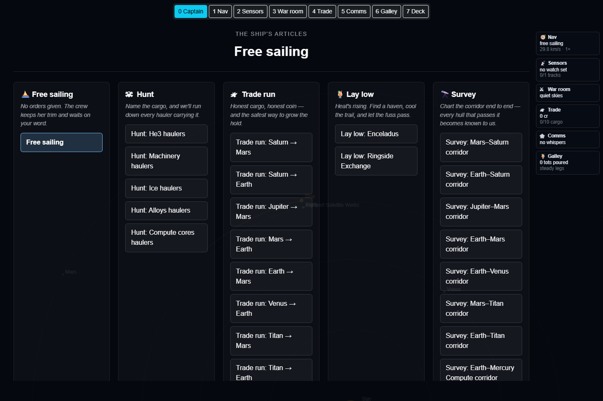
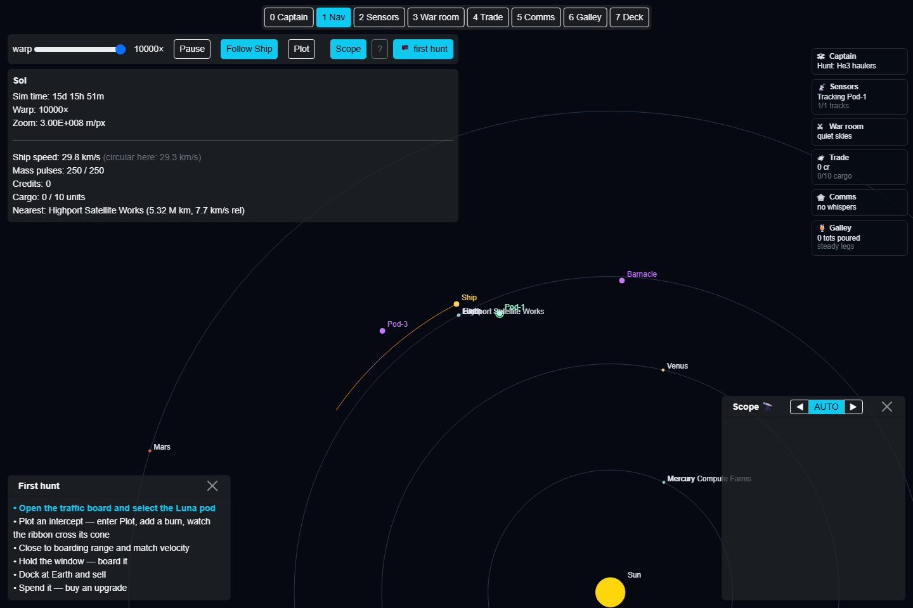
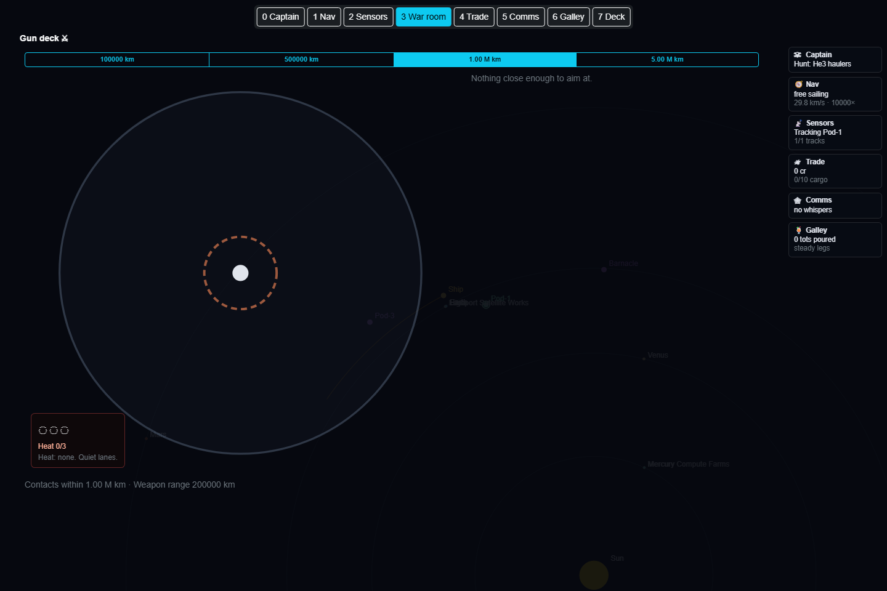
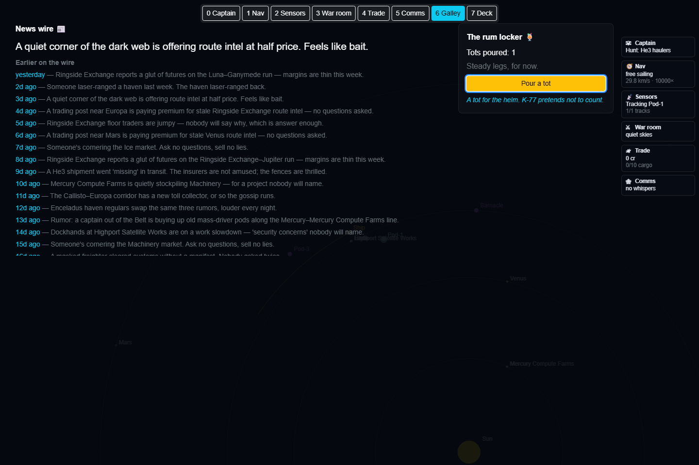
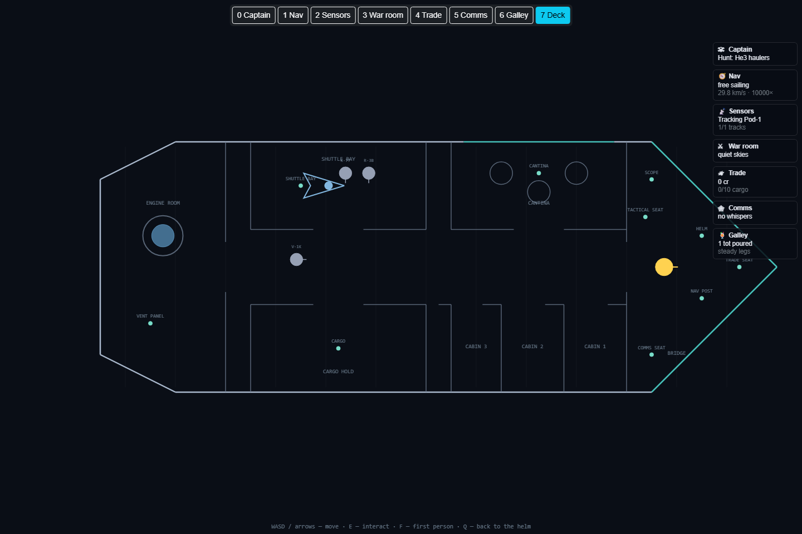

# Captain's Guide

*(This document mirrors the in-game guide at /guide.)*

SpaceSails is a solar-system sailing and piracy game with honest orbital mechanics.
Nothing here cheats: every trajectory is integrated, every orbit obeys the sun, and the
hardest maneuvers are hard because physics says so. This guide covers everything currently
aboard.

## 1. Choosing a voyage

- **Sol** — the classic system. Learn to fly here.
- **Sol (Electric)** ⚡ — same system plus a charged plasma environment:
a solar halo that charges your hull near the sun and flowing plasma streams between
planets. Charge makes you visible and eventually arcs; vent it with `V`.
- **The Wheel** — a rigid-spoke curiosity system with a plasma river,
for pilots who want strange skies.
- **Join the crew** — multiplayer: enter a callsign and share a live
session. Warp runs at the *slowest* crew member's request (the min-warp rule),
and you only see what your own sensors can see.
- Any voyage can be loaded straight from a link: `/map?scenario=sol`,
`sol-eu`, or `wheel`. Append `&mp=1&callsign=YourName` to join multiplayer
directly on that scenario, no home-page click needed.

## 2. The duty stations

The ship isn't flown from one crowded screen — it's crewed. A slim **station tab bar** at
the top center reads `0 Captain · 1 Nav · 2 Sensors · 3 War room · 4 Trade · 5 Comms ·
6 Galley · 7 Deck`. Click a tab, or just press its number key, and that desk takes the
screen. `Escape` always brings you back to Nav.

- Each desk gives its own topic the run of the screen — roughly 70% of it, instrument and
  all — instead of squeezing everything into small floating panels. The Sensors desk shows
  *every* tracked target at once, not one small box; the War room's tactical circle fills
  its half of the desk; and so on.
- Every other station still rides along as a small **summary chip** on the thin strip down
  the right edge of whatever desk you're on — its tightest current-objective line, never a
  stats dump. Click a chip to jump straight to that desk. The captain's mission chip leads
  the strip everywhere except the Captain desk itself.
- Number keys work from anywhere except while you're typing into a slider or number field.
  `7` (or the **7 Deck** tab) drops you onto the walkable deck, where sitting at a bridge
  console — the helm, the scope alcove, the comms seat, the tactical seat, the trade seat —
  opens that same desk with `E`. Same switch, three ways in: key, tab, or seat.

## 3. The captain's position

- Press `0` or click **0 Captain** — it leads the tab bar, because the captain's word comes
  before the helm's.
- The desk is one uncluttered statement of the ship's current standing order — *the ship's
  articles* — plus every mission you can give it, grouped as **Free sailing**, **Hunt** (run
  down a cargo class), **Trade run** (a directed route), **Lay low** (a haven to hide at),
  and **Survey** (chart a corridor end to end). Options come straight from the scenario
  you're sailing.
- **One click selects — no confirm dialog.** The order updates instantly and shows up as
  the `☠ Captain` chip on every other desk's summary strip.
- The mission doesn't fly the ship for you — Nav still flies, Sensors still watches, Trade
  still deals. It's the standing order the rest of the crew works to.

## 4. The map (the Nav desk)

- **Drag** to pan, **mouse wheel** to zoom, **Follow Ship** to re-center.
- The Nav toolbar keeps only true nav controls: the **warp slider** (logarithmic, 1× to
  10,000×; it auto-drops near planets and encounters so you don't overshoot the interesting
  parts), **Pause**, **Follow Ship**, **Plot**, **Scope**, and **?** for this guide.
  Everything else moved to its own duty station — see §2.
  Above 100×, the sim advances in fixed 60-second quanta instead of every frame —
  the same clock the traffic runs on, so nothing drifts out of sync at the high end.
- **HUD readouts** — sim time, ship speed with
*(circular here: …)* beside it: the speed that would hold a circular sun orbit at
your current distance. Match it and you coast forever; it is the difference between
matching a planet's *radius* and matching its *orbit*.
- **Mass pulses** — your reaction mass. Every burn spends pulses; refill by
docking at a market. Run dry far from port and you drift on whatever orbit you bought.

## 5. Flying by hand

- `+` / `−` (or `↑`/`↓`) — thrust pulse:
scales your velocity ±10%. Prograde only — pulses change your speed, never your heading.
- `Shift` + pulse — **fine trim**, ±1%. For station-keeping and
orbit matching.
- `V` — vent charge (Electric scenarios).
- Pulses have a short cooldown and each costs one mass pulse.

Rule of thumb: to go *inward* (Venus, Mercury), *brake* — losing speed drops
your perihelion. To go *outward* (Mars, Jupiter, Saturn), accelerate. You are always
trading speed for altitude on an ellipse.

## 6. Plotting a course

- **Plot** (on the Nav desk toolbar) opens the plotting table, or press `E` at the NAV POST
console inside the ship. The sim pauses while you plan.
- **Scrub slider** — slide into the future; every planet shows a
*ghost* at the scrubbed time, tethered to its live position.
- **Path length slider** — how far ahead your ribbon projects (5 days to
2 years, log scale). *auto* follows your last burn + 90 days. Short for
ship-to-ship work, long for interplanetary sails.
- **Add burn at scrub** — drops a maneuver node at the scrubbed time. Each
node has: **+/−** direction, **pulse count**, and a
**free percent field** — any decimal from 0.01% to 50% per pulse. A 10%
pulse is a hammer (~3 km/s); a 0.5% node is a scalpel.
- **Click a node marker on the ribbon** to select it — its row highlights
and the scrub jumps to that moment. **@** re-times a node to the current
scrub; **×** deletes it.
- The whole trip fits one plan: Earth→Saturn is a single sit-down (the plotting horizon
was sized for exactly that).
- **Closest pass** — the plot card names your tightest flyby along the planned path, in body
radii, with a marker on the ribbon. Under 5 R it turns yellow; through a planet it turns red
and says *IMPACT, captain*. When that pass is a planet close enough to matter, an **Insert at
*body* pass** button appears — arm it and the ship parks itself in orbit the instant the window
opens during live flight (see §7). Disarm the same way, by clicking it again.

### Worked examples

- **Mercury**: one node, *decelerate ×3* (10%) at ~day 3 →
perihelion kisses Mercury's orbit ~day 334. At closest approach, brake twice more and
trim until ship speed equals *circular here* (47.9 km/s) — then cut the gas and
orbit forever.
- **Saturn**: one node, *accelerate ×12* at the right departure day
(phasing!) → Saturn's port zone in ~9 months. Use the ghosts to find the day when
ghost-Saturn meets your ghost-ship.

## 7. Orbit assist — the bus stops of space

- Prograde pulses can never *turn* you into a planetary orbit, so the ship does it for you.
  Get near a planet and a strip appears in the Nav HUD: **🛰 Orbit *body* —**
*window OPEN*, *too fast (max 5.0 km/s rel)*, or *get inside the Hill sphere*.
Two bars underneath show distance-vs-Hill-sphere and speed-vs-limit at a glance.
- Press **O** (or the panel's **Enter orbit** button) once the window is open.
It's an instant burn that matches the body's velocity plus local circular
speed — the pulse cost scales honestly with the actual Δv needed, so a sloppy
fast approach costs more pulses than a gentle one. The button disables itself
if you can't afford the cost. Once bound, you circle for free, forever: a parked
ship is a stable ambush point, and warp opens up to 1000× while you wait.
- The panel favors an **armed** target over merely-nearest, so plotting a
planned insertion at Mars won't get hijacked by a HUD strip for Earth on the
way past — see §6's Closest pass note for arming one in advance.
- Every planet keeps an **orbital depot** — a parked cargo barge circling it
(compute cores at Mercury, alloys at Venus, machinery at Earth, ice at Mars, He3
everywhere further out). Depots ride a fixed circular orbit and never maneuver. Park at
the same bus stop, wait for it to swing around, and board it like any prey.
- Mind the sun: it is drawn (and enforced) fat — sun-grazing slingshots crawl through wide
  slow-warp zones, the planner flags them, and in ⚡ scenarios they cook your hull. The sun
  never shows this panel — you already orbit it by definition.

## 8. Piracy

- Ships and pods are **clickable on the map** — clicking a contact selects it just like
  picking its row on the Comms desk's departures board (§11): the scope tracks it and the
  prediction cone pins to it. The scope's AUTO mode always shows the nearest object, planet
  or ship.
- Select a target and **Pin** its predicted path — a cone of where it can be,
given its maneuver budget.
- Plot an intercept so your ribbon crosses the cone, close to within the
**capture envelope** (500,000 km and 5 km/s relative), and hold it.
The boarding clock runs on *wall-clock time* — shuttles fly in real time, warp
be damned. A tighter, slower pass boards faster.
- Or fly it yourself: walk to the **SHUTTLE BAY** while the window is
engaged and press `E` — see §15.
- Boarded cargo goes in your hold. **Dock** at a market (Earth, Mars,
Venus — get within the port zone) to **sell cargo** (He3 pays best at 1200
cr/unit, then compute cores, alloys, machinery; ice pays the rent at 100) and
**refill mass pulses** for free. Spend credits on four upgrade tracks —
reaction-mass capacity, sensor range, cargo hold, and telescope count — each
a level-up costing 2,000 credits and doubling every level thereafter. See the Trade desk,
§10.

## 9. The Sensors desk 📡

- Press `2` or click **2 Sensors**. The live map dims in behind it — the desk's own
  instrument is the **scope wall**: one live scope canvas per tracked target, all running
  at once, not one small inset.
- A **rosette** shows your detection envelope live as an egg-shape relative to the sun:
  pointed straight at the sun you're nearly blind (8% of the telescope's 6×10¹¹ m base
  range); pointed straight away from it (anti-sunward) you see the full range — the
  pirate's best hunting angle, dark sky at your back.
- Aim by dragging the **bearing** and **arc width** sliders, or pick a ready-made
  **scanning program** that covers a known trade corridor (Venus–Earth, Earth–Mars, and
  onward to Jupiter and Saturn), then **Start sweep**. A full 360° survey spends 6
  sim-hours, scaling down for a narrower wedge — but it finds ships the Comms desk's
  departures board can't: secretive haulers that don't publish a timetable.
- Found contacts join the **tracked-targets ledger**, one tile per hit on the wall.
  **Confirm** does a short re-look at a target's predicted position rather than a fresh
  sweep, and bumps quality back up — skip it too long (5+ days) or let the target burn hard
  enough to slip the cone, and quality decays until the lock is lost for good. **Drop**
  frees the slot.
- **Telescope count** (an upgrade on the Trade desk's dock market, alongside reaction mass,
  sensor range, and cargo hold) is how many ships you can hold on the ledger — and wall
  tiles you get — at once: 1 at the base level, up to 4 at max.
- A well-tracked ship draws with a tighter ring on the map itself — a good, fresh lock
  visibly sharpens the intercept, down to 30% of the ordinary prediction-cone width at a
  perfect reconfirm.

## 10. The Trade desk 🛰

- Press `4` or click **4 Trade** for the whole trade loop in one place: **local space**
  contacts on one side, the **dock market** alongside it, and your **cargo manifest** (by
  class, with fence value) on the third.
- **Local space** lists everything else parked at your current body: depots 🛰, stations 🏭,
  moons 🌙, havens 🏴, and any ship 🚀 caught nearby, each tagged with what it offers — Trade,
  Fence, or Board.
- Trading works two ways: **same-orbit** (you and the counterpart are bound to the same
  body — the classic bus stop) or **course-matched** (within 500,000 km and under 2 km/s
  relative speed of a moving partner) — a friendlier envelope than boarding, since
  cooperative cargo drones aren't chasing anyone. Hit **Trade** and drones ferry your whole
  hold over in real time (a striped progress bar, ~20 seconds per cargo unit at a clean
  match, slower the sloppier the geometry) — the same sale prices as docking, just a second
  place to make it. Drift out of range mid-transfer and the progress is lost, no partial
  credit.
- Unlike the old floating panel, this desk doesn't yank you here the moment you bind into
  orbit — the Trade chip on other desks updates live instead, so you notice a new contact
  without losing your view of Nav; switching over to deal with it stays a deliberate action
  (number key, tab, or chip click).
- The **dock market** panel shows when you're actually docked: **Sell cargo** at fence
  prices (He3 pays best at 1200 cr/unit, then compute cores, alloys, machinery; ice pays
  the rent at 100), **Refill mass** for free, and four **upgrade tracks** — reaction-mass
  capacity, sensor range, cargo hold, and telescope count — each a level-up costing 2,000
  credits and doubling every level thereafter.
- The **cargo manifest** is always visible here, transfer-in-progress and all, so you can
  see exactly what's riding in the hold without opening anything else.
- Anything the local-space list shows that's co-orbiting your current body also gets a
  subtle ring on the map itself, right where you're already looking.

## 11. The Comms desk 🕸

- Press `5` or click **5 Comms**. A news ticker runs across the top (see §14's Galley for
  the long-form wire), with the **departures board** — cargo pods, freighters, their
  routes, departure times, last-seen data, and a **Pin** button — down one side and the
  **dark web** down the other.
- The **dark web** is the black market in information. It only opens for business at a
  **pirate haven** or a **far trading post** — any station beyond 4×10¹¹ m from the sun;
  ordinary planets and central-space stations never deal in stolen timetables.
- **Buy** a route tip on an off-the-books ship and it appears on the departures board,
  tagged with a **stale in Nd** badge — farther from Earth, the tip is cheaper (secrets are
  common currency out where nobody's watching). A bought tip is good for 30 sim-days.
- **Sell** your own Sensors-desk finds once they're 50%+ quality — selling never erases the
  track, so a good lock is repeatable income, not a one-shot.
- **Tight-beam** hails a tracked contact directly (short range, no broadcast) — an honest
  ship tells you its destination, a secretive one stonewalls.
- **Laser range** trades a perfect, instant fix on a tracked target for lighting yourself
  up — the target (and anyone watching) now knows roughly where the shot came from. Passive
  sweeping never gives you away; these two tools are the deliberate exceptions.

## 12. The War room ⚔

- Press `3` or click **3 War room** for the full-screen tactical circle: your ship at the
  center, a weapon-range ring (2×10⁸ m — shorter than the boarding shuttle's capture
  envelope), and a catch-radius ring around any hunter on your tail, with the heat gauge
  blown up large in the corner.
- **Warn** a target inside weapon range. Compliant ships (about 3 in 4) heave
to and board at half the usual time; stubborn ones (about 1 in 4, rising
slightly with your heat) call their own muscle instead — which ship is which
never changes, so warning the same one twice always plays out the same way.
- **Hail** for a canned in-character reply, **Bribe** for guaranteed compliance
with zero heat generated (priced under what an honest robbery would pay) — an
inside job, nobody calls the cavalry.
- Actually robbing a ship (not just warning it) raises **heat**, a 0–3 flame
gauge that decays one level per 20 days — four times faster while you're
hidden in orbit at a haven. High enough heat and a **hunter** spawns: hired
muscle that fits out for 5 days, then hunts you down at a slow, relentless
thrust. Get caught (within 3×10⁸ m, under 3,000 m/s relative) and it seizes
your hold plus a 500 cr fine; stay hidden at a haven for 2 days straight and
it gives up the chase.
- Havens are the release valve for the whole loop: cool your heat, trade cargo
and (if it's also a far trading post) intel, and repair — no questions asked.

## 13. The scope

- **Scope**, on the Nav toolbar, opens a small instrument overlay: auto-locks the nearest
  interesting contact, draws it (freighters, pods, players, planets, the sun, plasma
  wisps), and reads out distance and relative speed.
- **◀ / ▶** cycle targets manually; the middle button returns to **AUTO**. For every
  tracked target at once, full-screen, see the Sensors desk's scope wall instead (§9).

## 14. The Galley 🍹

- Press `6` or click **6 Galley** — the desk built to prove the summary strip works
  everywhere, and the home of ship gossip.
- The **news wire** posts a deterministic headline per sim-day (world events, plunder
  rumors, price gossip) plus the last several days' scrollback — the same feed the Comms
  desk's ticker draws its short slice from.
- The **rum locker** pours a tot on demand, wired to the exact same rum ledger the deck's
  CANTINA console uses (see [deck-view.md](features/deck-view.md#the-cantina--mind-the-third-tot)) —
  tot count and the third-tot wobble stay in sync between the two entry points.

## 15. Inside the ship — the Deck

- Press `7` or click **7 Deck** — top-down plan of your pirate sail. Walk with
`WASD`/arrows, interact with `E`, drag the map if the bow hides
behind a panel. Crew: droids K-77 and R-3B stand by the shuttle; V-1K patrols.
- `F` — **first person**. Walk the corridors; the windows show the
real sky — the sun blazes bigger the closer you sail, and the planets are where the
ephemeris says they are. `Q` returns to the helm (and the Nav desk).
- Consoles are **bridge seats**: sit at one and press `E` to open its desk. **HELM** and
  **NAV POST** open Nav (the nav post also lights up the plotting table); **SCOPE** opens
  Sensors; **CANTINA** opens the Galley (rum — mind the third tot); **COMMS SEAT** opens
  Comms; **TACTICAL SEAT** opens the War room; **TRADE SEAT** opens Trade. Plus **CARGO**
  (a look at your hold), **VENT PANEL**, and the **SHUTTLE BAY**.
- **The boarding run**: with a capture window engaged, `E` at the
shuttle bay puts you on the stick. Cross the gap with `WASD` thrust, dock at
the airlock *below the speed limit* (come in hot and you bounce), and the droids
swarm aboard — instant boarding. `Q` aborts; losing the window auto-returns
the shuttle. The prey's drift is your real relative velocity — a sloppy pass by the
mothership makes a hard run for the pilot.

## 16. The electric sky ⚡

- Near the sun the plasma halo charges your hull; the flowing ribbons between planets
are **plasma streams** — riding one pushes you along it (charged hulls
feel the current).
- Charge makes you glow on everyone's sensors — it pierces even sun glare — and at full
charge you start arcing. `V` vents.
- Mercury's neighborhood runs ~75% ambient charge. Ambush country: everyone there is
visible, desperate, or both.

## 17. The physics, honestly

- **There is no drag.** A circular orbit holds forever with zero thrust
(measured: −0.025% radius drift over a full year).
- What feels like drag near a planet is the planet's gravity plus solar tide shearing
you off your line. Get inside a planet's sphere of influence and it owns you; match
speed at the same sun-distance far from it and you fly formation with it forever.
- Fire your circularization at perihelion or aphelion — those are the moments your
velocity is purely tangential, and pulses only scale velocity, never rotate it.
- Phasing beats thrust: launch day matters more than pulse count for reaching a moving
target. Scrub, watch the ghosts, move the node.

Fair winds and following gravity, captain. 🏴‍☠️
