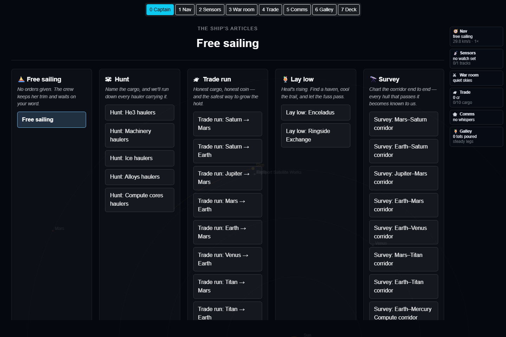
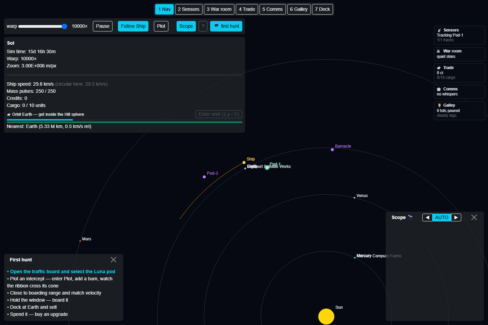
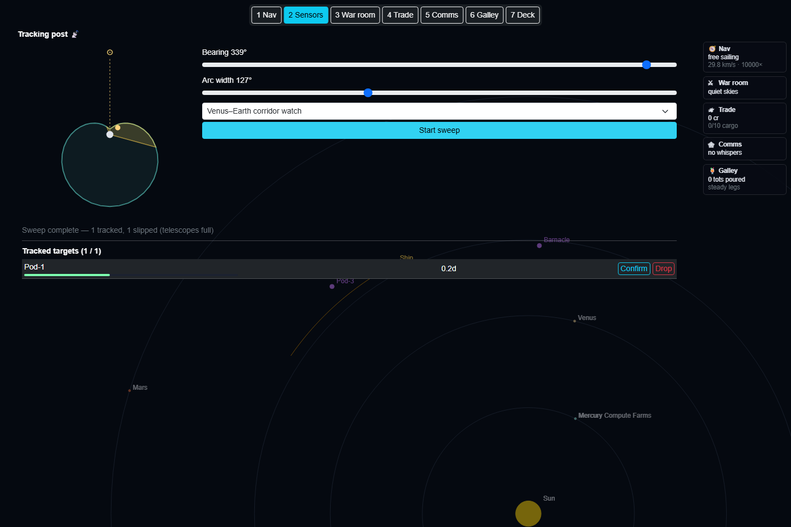
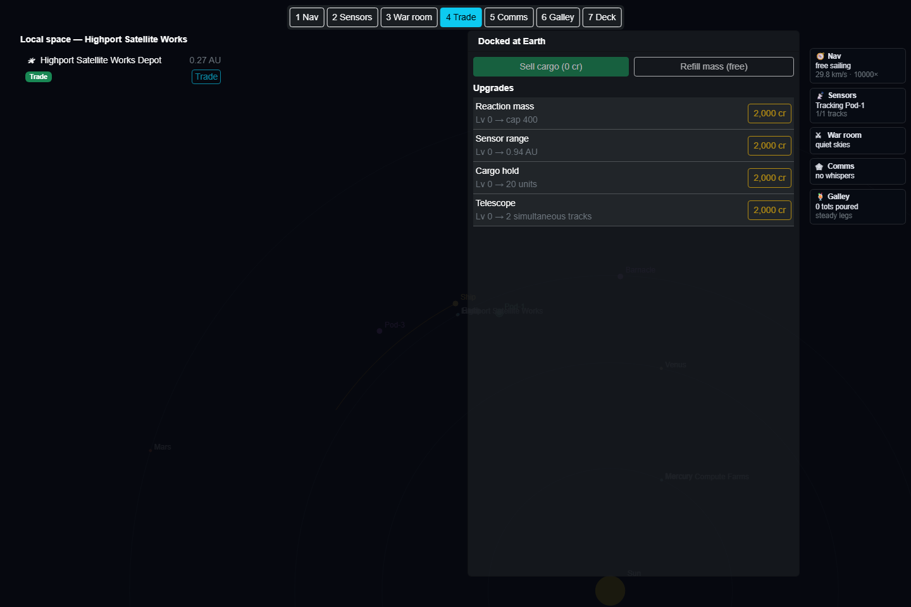
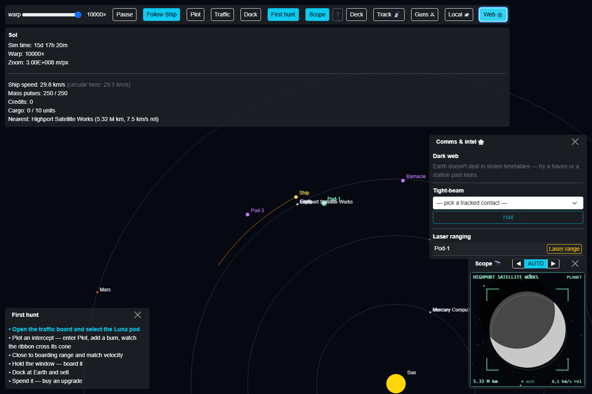
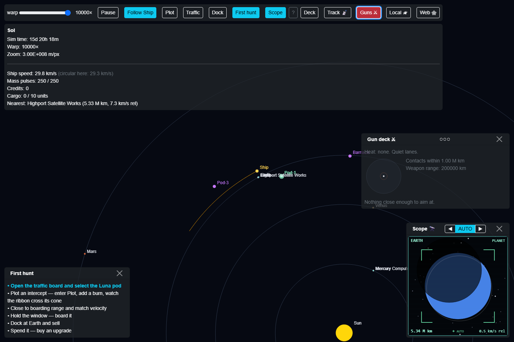
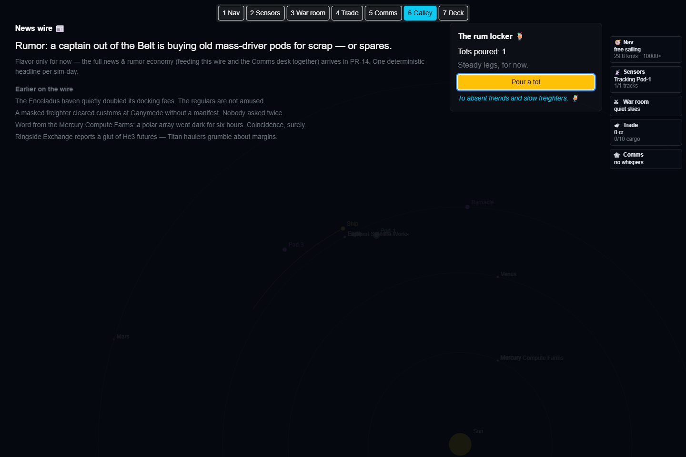
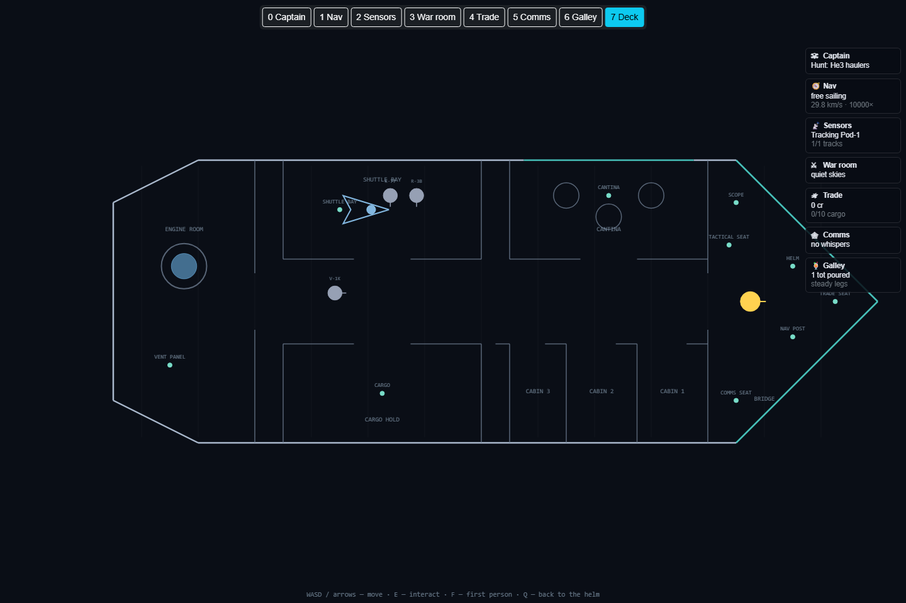

# Captain's Guide

*(This document mirrors the in-game guide at /guide.)*


SpaceSails is a solar-system sailing and piracy game with honest orbital mechanics.
Nothing here cheats: every trajectory is integrated, every orbit obeys the sun, and the
hardest maneuvers are hard because physics says so. This guide covers everything currently
aboard.


## 1. Choosing a voyage

- **Sol** — the classic system. Learn to fly here.
- **Sol (Electric)** ⚡ — same system plus a charged plasma environment:
a solar halo that charges your hull near the sun and flowing plasma streams between
planets. Charge makes you visible and eventually arcs; vent it with `V`.
- **The Wheel** — a rigid-spoke curiosity system with a plasma river,
for pilots who want strange skies.
- **Join the crew** — multiplayer: enter a callsign and share a live
session. Warp runs at the *slowest* crew member's request (the min-warp rule),
and you only see what your own sensors can see.
- Any voyage can be loaded straight from a link: `/map?scenario=sol`,
`sol-eu`, or `wheel`. Append `&mp=1&callsign=YourName` to join multiplayer
directly on that scenario, no home-page click needed.


## 2. The duty stations

The ship isn't flown from one crowded screen — it's crewed. A slim **station tab bar** at
the top center reads `0 Captain · 1 Nav · 2 Sensors · 3 War room · 4 Trade · 5 Comms ·
6 Galley · 7 Deck`. Click a tab, or just press its number key, and that desk takes the
screen. `Escape` always brings you back to Nav.

- Each desk gives its own topic the run of the screen — roughly 70% of it, instrument and
  all — instead of squeezing everything into small floating panels. The Sensors desk shows
  *every* tracked target at once, not one small box; the War room's tactical circle fills
  its half of the desk; and so on.
- Every other station still rides along as a small **summary chip** on the thin strip down
  the right edge of whatever desk you're on — its tightest current-objective line, never a
  stats dump. Click a chip to jump straight to that desk. The captain's mission chip leads
  the strip everywhere except the Captain desk itself.
- Number keys work from anywhere except while you're typing into a slider or number field.
  `7` (or the **7 Deck** tab) drops you onto the walkable deck, where sitting at a bridge
  console — the helm, the scope alcove, the comms seat, the tactical seat, the trade seat —
  opens that same desk with `E`. Same switch, three ways in: key, tab, or seat.


## 3. The captain's position



- Press `0` or click **0 Captain** — it leads the tab bar, because the captain's word comes
  before the helm's.
- The desk is one uncluttered statement of the ship's current standing order — *the ship's
  articles* — plus every mission you can give it, grouped as **Free sailing**, **Hunt** (run
  down a cargo class), **Trade run** (a directed route), **Lay low** (a haven to hide at),
  and **Survey** (chart a corridor end to end). Options come straight from the scenario
  you're sailing.
- **One click selects — no confirm dialog.** The order updates instantly and shows up as
  the `☠ Captain` chip on every other desk's summary strip.
- The mission doesn't fly the ship for you — Nav still flies, Sensors still watches, Trade
  still deals. It's the standing order the rest of the crew works to.


## 4. The map (the Nav desk)



- **Drag** to pan, **mouse wheel** to zoom, **Follow Ship** to re-center.
- The Nav toolbar keeps only true nav controls: the **warp slider** (logarithmic, 1× to
  10,000×; it auto-drops near planets and encounters so you don't overshoot the interesting
  parts), **Pause**, **Follow Ship**, **Plot**, **Scope**, and **?** for this guide.
  Everything else moved to its own duty station — see §2.
  Above 100×, the sim advances in fixed 60-second quanta instead of every frame —
  the same clock the traffic runs on, so nothing drifts out of sync at the high end.
- **HUD readouts** — sim time, ship speed with
*(circular here: …)* beside it: the speed that would hold a circular sun orbit at
your current distance. Match it and you coast forever; it is the difference between
matching a planet's *radius* and matching its *orbit*.
- **Mass pulses** — your reaction mass. Every burn spends pulses; refill by
docking at a market. Run dry far from port and you drift on whatever orbit you bought.


## 5. Flying by hand

- `+` / `−` (or `↑`/`↓`) — thrust pulse:
scales your velocity ±10%. Prograde only — pulses change your speed, never your heading.
- `Shift` + pulse — **fine trim**, ±1%. For station-keeping and
orbit matching.
- `V` — vent charge (Electric scenarios).
- Pulses have a short cooldown and each costs one mass pulse.


Rule of thumb: to go *inward* (Venus, Mercury), *brake* — losing speed drops
your perihelion. To go *outward* (Mars, Jupiter, Saturn), accelerate. You are always
trading speed for altitude on an ellipse.


## 6. Plotting a course

- **Plot** (on the Nav desk toolbar) opens the plotting table, or press `E` at the NAV POST
console inside the ship. The sim pauses while you plan.
- **Scrub slider** — slide into the future; every planet shows a
*ghost* at the scrubbed time, tethered to its live position.
- **Path length slider** — how far ahead your ribbon projects (5 days to
2 years, log scale). *auto* follows your last burn + 90 days. Short for
ship-to-ship work, long for interplanetary sails.
- **Add burn at scrub** — drops a maneuver node at the scrubbed time. Each
node has: **+/−** direction, **pulse count**, and a
**free percent field** — any decimal from 0.01% to 50% per pulse. A 10%
pulse is a hammer (~3 km/s); a 0.5% node is a scalpel.
- **Click a node marker on the ribbon** to select it — its row highlights
and the scrub jumps to that moment. **@** re-times a node to the current
scrub; **×** deletes it.
- The whole trip fits one plan: Earth→Saturn is a single sit-down (the plotting horizon
was sized for exactly that).
- **Closest pass** — the plot card names your tightest flyby along the planned path, in body
radii, with a marker on the ribbon. Under 5 R it turns yellow; through a planet it turns red
and says *IMPACT, captain*. When that pass is a planet close enough to matter, an **Insert at
*body* pass** button appears — arm it and the ship parks itself in orbit the instant the window
opens during live flight (see §7). Disarm the same way, by clicking it again.


### Worked examples

- **Mercury**: one node, *decelerate ×3* (10%) at ~day 3 →
perihelion kisses Mercury's orbit ~day 334. At closest approach, brake twice more and
trim until ship speed equals *circular here* (47.9 km/s) — then cut the gas and
orbit forever.
- **Saturn**: one node, *accelerate ×12* at the right departure day
(phasing!) → Saturn's port zone in ~9 months. Use the ghosts to find the day when
ghost-Saturn meets your ghost-ship.


## 7. Orbit assist — the bus stops of space

- Prograde pulses can never *turn* you into a planetary orbit, so the ship does it for you.
  Get near a planet and a strip appears in the Nav HUD: **🛰 Orbit *body* —**
*window OPEN*, *too fast (max 5.0 km/s rel)*, or *get inside the Hill sphere*.
Two bars underneath show distance-vs-Hill-sphere and speed-vs-limit at a glance.
- Press **O** (or the panel's **Enter orbit** button) once the window is open.
It's an instant burn that matches the body's velocity plus local circular
speed — the pulse cost scales honestly with the actual Δv needed, so a sloppy
fast approach costs more pulses than a gentle one. The button disables itself
if you can't afford the cost. Once bound, you circle for free, forever: a parked
ship is a stable ambush point, and warp opens up to 1000× while you wait.
- The panel favors an **armed** target over merely-nearest, so plotting a
planned insertion at Mars won't get hijacked by a HUD strip for Earth on the
way past — see §6's Closest pass note for arming one in advance.
- Every planet keeps an **orbital depot** — a parked cargo barge circling it
(compute cores at Mercury, alloys at Venus, machinery at Earth, ice at Mars, He3
everywhere further out). Depots ride a fixed circular orbit and never maneuver. Park at
the same bus stop, wait for it to swing around, and board it like any prey.
- Mind the sun: it is drawn (and enforced) fat — sun-grazing slingshots crawl through wide
  slow-warp zones, the planner flags them, and in ⚡ scenarios they cook your hull. The sun
  never shows this panel — you already orbit it by definition.


## 8. Piracy

- Ships and pods are **clickable on the map** — clicking a contact selects it just like
  picking its row on the Comms desk's departures board (§11): the scope tracks it and the
  prediction cone pins to it. The scope's AUTO mode always shows the nearest object, planet
  or ship.
- Select a target and **Pin** its predicted path — a cone of where it can be,
given its maneuver budget.
- Plot an intercept so your ribbon crosses the cone, close to within the
**capture envelope** (500,000 km and 5 km/s relative), and hold it.
The boarding clock runs on *wall-clock time* — shuttles fly in real time, warp
be damned. A tighter, slower pass boards faster.
- Or fly it yourself: walk to the **SHUTTLE BAY** while the window is
engaged and press `E` — see §15.
- Boarded cargo goes in your hold. **Dock** at a market (Earth, Mars,
Venus — get within the port zone) to **sell cargo** (He3 pays best at 1200
cr/unit, then compute cores, alloys, machinery; ice pays the rent at 100) and
**refill mass pulses** for free. Spend credits on four upgrade tracks —
reaction-mass capacity, sensor range, cargo hold, and telescope count — each
a level-up costing 2,000 credits and doubling every level thereafter. See the Trade desk,
§10.


## 9. The Sensors desk 📡



- Press `2` or click **2 Sensors**. The live map IS the desk — the sky dims in behind the
  instruments but stays fully clickable: pan it, zoom it, and **point at anything to ask
  what's there**. Ships, planets, trade lanes, and even empty space all answer a click with
  scan options. (Navigation stays on the Nav desk — a planet here offers a scan, not a
  course.)
- The ship carries **one steerable telescope**, and everything you ask of it lands on the
  **Sensor tasks** list: custody passes on tracked ships, area scans, lane sweeps,
  lost-target searches. The instrument works that list top to bottom and wraps around.
  Reorder with ▲▼, jump a task to the very next pass with ⏫, cancel one-shots with ✕. The
  wedge it is scanning *right now* is drawn on the sky, filling in brighter as the exposure
  completes.
- **Trade lanes** are not drawn on the sky any more (they used to be faint labeled corridors,
  and nobody ever found anything with them), but they are still places you can *watch*. Click
  empty sky and the **Open Sky** menu prices a scan of that patch (the patch follows your
  zoom) — and a scan always resolves *something*: debris, rocks, cold pods, sometimes a
  derelict. When the patch sits near a known lane — Venus–Earth, Earth–Mars, onward to
  Jupiter and Saturn — the menu names it and offers to **sweep the lane instead**, or to post
  a **standing lane watch**. That is how you find the secretive haulers the Comms departures
  board can't tell you about.
- A **rosette** shows your detection envelope live as an egg-shape relative to the sun:
  pointed straight at the sun you're nearly blind (8% of the telescope's 6×10¹¹ m base
  range); anti-sunward you see the full range — the pirate's best hunting angle. The
  **passive watch** (a free full-circle survey) fills idle telescope time, and the
  bearing/arc sliders still give a manual sweep that preempts everything.
- Found contacts join the **tracked-targets ledger** — one card per slot, each with its own
  **live scope box**; ● ON SCOPE marks the one the telescope is updating right now.
  **Confirm** does a short re-look; **Drop** frees the slot. Custody is a real resource:
  tracking one ship is near-continuous, tracking four plus a lane watch leaves gaps a
  transponder-dark ship can burn inside.
- **Lose a lock** and the ship doesn't just vanish: a pulsing **search area** opens on the
  map where she must still be, growing with time, and a 🔍 search task joins the queue.
  Fruitless passes shrink the area; **⏫ PRIORITIZE REDISCOVERY** makes the search the very
  next pass at the price of everything else waiting; wait too long and the trail goes cold.
- **Telescope level** (an upgrade on the Trade desk's dock market) sets both your ledger
  slots — 1 at base, up to 4 — and how fast every telescope pass runs.
- A well-tracked ship draws with a tighter ring on the map itself — a good, fresh lock
  visibly sharpens the intercept, down to 30% of the ordinary prediction-cone width at a
  perfect reconfirm.

## 10. The Trade desk 🛰



- Press `4` or click **4 Trade**. The desk is a **master–detail tree, like File Explorer**:
  the left pane lists **places of business** — each host body, the trading posts at it, and
  under every post its **Buy** (down to the item) and **Sell** branches. Tree rows stay lean
  (name + one reachability badge: same orbit / drones / shuttles / out of reach); select any
  node and the right pane shows *that node's* full detail — clickable **breadcrumbs**
  (`Earth › Earth Depot › Buy › Machinery`) keep you oriented. The **cargo manifest** keeps
  its own column.
- The **dockyard** appears as a node under the body you're docked at — selling at fence
  prices, refilling mass, and the four upgrade tracks are *its* detail now, not a loose
  floating market.
- An item leaf shows stock, face value, and one actionable **🛒 Buy** button priced for how
  the deal would move right now (fee and minutes included), with the cheaper dockside option
  noted; **Sell your hold here** shows the net payout. Anything impossible says why in plain
  words (hold empty, not enough credits, out of reach — and what to do about it).
- **Buying is real**: depots sell their manifest at face value **plus a ferry fee** per
  unit — 25 cr on the shuttle corridor, 5 cr for a drone match, and **free dockside** (same
  orbit). Hauling something heavy? Close in and match orbit to skip the fee — that's the
  economic reason to dock. The fee also means buy-and-flip through the shuttles is always a
  losing round trip; profit comes from hauling goods somewhere better.
- Trading tiers: **same-orbit** (the classic bus stop, fee-free), **course-matched** (within
  500,000 km and under 2 km/s — cooperative cargo drones), or **shuttle reach** (a slow pass
  within 12 M km at ≤5 km/s — shuttles fly the long corridor). Transfers run in real time (a
  striped progress bar, slower the sloppier the geometry); drift out of the envelope
  mid-transfer and the progress is lost, no partial credit.
- Unlike the old floating panel, this desk doesn't yank you here the moment you bind into
  orbit — the Trade chip on other desks updates live instead, so you notice a new contact
  without losing your view of Nav; switching over to deal with it stays a deliberate action
  (number key, tab, or chip click).
- The **dock market** panel shows when you're actually docked: **Sell cargo** at fence
  prices (He3 pays best at 1200 cr/unit, then compute cores, alloys, machinery; ice pays
  the rent at 100), **Refill mass** for free, and four **upgrade tracks** — reaction-mass
  capacity, sensor range, cargo hold, and telescope count — each a level-up costing 2,000
  credits and doubling every level thereafter.
- The **cargo manifest** is always visible here, transfer-in-progress and all, so you can
  see exactly what's riding in the hold without opening anything else.
- Anything the local-space list shows that's co-orbiting your current body also gets a
  subtle ring on the map itself, right where you're already looking.

## 11. The Comms desk 🕸



- Press `5` or click **5 Comms**. A news ticker runs across the top (see §14's Galley for
  the long-form wire), with the **departures board** — cargo pods, freighters, their
  routes, departure times, last-seen data, and a **Pin** button — down one side and the
  **dark web** down the other.
- The **dark web** is the black market in information. It only opens for business at a
  **pirate haven** or a **far trading post** — any station beyond 4×10¹¹ m from the sun;
  ordinary planets and central-space stations never deal in stolen timetables.
- **Buy** a route tip on an off-the-books ship and it appears on the departures board,
  tagged with a **stale in Nd** badge — farther from Earth, the tip is cheaper (secrets are
  common currency out where nobody's watching). A bought tip is good for 30 sim-days.
- **Sell** your own Sensors-desk finds once they're 50%+ quality — selling never erases the
  track, so a good lock is repeatable income, not a one-shot.
- **Tight-beam** hails a tracked contact directly (short range, no broadcast) — an honest
  ship tells you its destination, a secretive one stonewalls.
- **Laser range** trades a perfect, instant fix on a tracked target for lighting yourself
  up — the target (and anyone watching) now knows roughly where the shot came from. Passive
  sweeping never gives you away; these two tools are the deliberate exceptions.

## 12. The War room ⚔



- Press `3` or click **3 War room** for the full-screen tactical circle: your ship at the
  center, a weapon-range ring (2×10⁸ m — shorter than the boarding shuttle's capture
  envelope), and a catch-radius ring around any hunter on your tail, with the heat gauge
  blown up large in the corner.
- **Warn** a target inside weapon range. Compliant ships (about 3 in 4) heave
to and board at half the usual time; stubborn ones (about 1 in 4, rising
slightly with your heat) call their own muscle instead — which ship is which
never changes, so warning the same one twice always plays out the same way.
- **Hail** for a canned in-character reply, **Bribe** for guaranteed compliance
with zero heat generated (priced under what an honest robbery would pay) — an
inside job, nobody calls the cavalry.
- Actually robbing a ship (not just warning it) raises **heat**, a 0–3 flame
gauge that decays one level per 20 days — four times faster while you're
hidden in orbit at a haven. High enough heat and a **hunter** spawns: hired
muscle that fits out for 5 days, then hunts you down at a slow, relentless
thrust. Get caught (within 3×10⁸ m, under 3,000 m/s relative) and it seizes
your hold plus a 500 cr fine; stay hidden at a haven for 2 days straight and
it gives up the chase.
- Havens are the release valve for the whole loop: cool your heat, trade cargo
and (if it's also a far trading post) intel, and repair — no questions asked.


## 13. The scope

- **Scope**, on the Nav toolbar, opens a small instrument overlay: auto-locks the nearest
  interesting contact, draws it (freighters, pods, players, planets, the sun, plasma
  wisps), and reads out distance and relative speed.
- **◀ / ▶** cycle targets manually; the middle button returns to **AUTO**. For every
  tracked target at once, full-screen, see the Sensors desk's scope wall instead (§9).


## 14. The Galley 🍹



- Press `6` or click **6 Galley** — the desk built to prove the summary strip works
  everywhere, and the home of ship gossip.
- The **news wire** posts a deterministic headline per sim-day (world events, plunder
  rumors, price gossip) plus the last several days' scrollback — the same feed the Comms
  desk's ticker draws its short slice from.
- The **rum locker** pours a tot on demand, wired to the exact same rum ledger the deck's
  CANTINA console uses (see [deck-view.md](features/deck-view.md#the-cantina--mind-the-third-tot)) —
  tot count and the third-tot wobble stay in sync between the two entry points.


## 15. Inside the ship — the Deck



- Press `7` or click **7 Deck** — top-down plan of your pirate sail. Walk with
`WASD`/arrows, interact with `E`, drag the map if the bow hides
behind a panel. Crew: droids K-77 and R-3B stand by the shuttle; V-1K patrols.
- `Q` returns to the helm (and the Nav desk) from anywhere on the deck.
- Consoles are **bridge seats**: sit at one and press `E` to open its desk. **HELM** and
  **NAV POST** open Nav (the nav post also lights up the plotting table); **SCOPE** opens
  Sensors; **CANTINA** opens the Galley (rum — mind the third tot); **COMMS SEAT** opens
  Comms; **TACTICAL SEAT** opens the War room; **TRADE SEAT** opens Trade. Plus **CARGO**
  (a look at your hold), **VENT PANEL**, and the **SHUTTLE BAY**.
- **The boarding run**: with a capture window engaged, `E` at the
shuttle bay puts you on the stick. Cross the gap with `WASD` thrust, dock at
the airlock *below the speed limit* (come in hot and you bounce), and the droids
swarm aboard — instant boarding. `Q` aborts; losing the window auto-returns
the shuttle. The prey's drift is your real relative velocity — a sloppy pass by the
mothership makes a hard run for the pilot.


## 16. Going ashore — the ground, the Old Ones, and your nerve 🌑

Docking is not the only way off the ship. Bodies with ground can be **landed on**: walk to
the **SHUTTLE BAY**, board, pick a landing site, and ride down. Down there you are on foot,
in a suit, and the ground keeps what you leave in it.

- **Sites are worlds, not levels.** Every landable body offers a seeded set of 2–4 landing
  sites, each named in the house voice. Site 0 is always the body's canon ground (Phobos's
  monolith, Miranda's false-slab maze, Luna's mass-driver ruins); the others re-seed a visibly
  different layout.
- **Dig with `E`.** Carrying a chest, `E` buries it *where you stand* and an ✗ marks the spot.
  Empty-handed, `E` probes the square for what somebody else buried. A buried hoard lives off
  the ship, so no confiscation can ever touch it.
- **`T` sets a sentry.** A deployed bot fires until its magazine reads `00`. Bots buy time,
  never safety. Retrieve them before you lift off or they are written off.
- **The landing pad is fused rockcrete.** Nothing buries there — carry it out onto the
  regolith first.

### The Old Ones

Dig deep, or dig where a pack is already stirring, and you rouse the **Reevers**. They are
patient, ancient and many, and they converge from every edge of the ground.

The thing to know: **they are not after your chest. They want you.** That is also the mercy
in them — a Reever cannot be bought, warned or reasoned with, but it is slow, and it loses a
captain it can no longer see. *Fleeing works.* Keep a lane to the tube mouth open and never
let a net wedge you into a corner. They cannot follow you up the tube: the shuttle door opens
to crew only.

They will, however, come **all the way**. Standing beside your own ship does not stop them.

### The two meters, and what each one means

You carry two, and they answer different questions.

| | What it counts | What runs it out |
|---|---|---|
| **NERVE** (ten pips) | how steady your hands are | fear — proximity, being cornered, the monolith, being caught |
| **CONDITION** (five pips) | how many blows you can still take | an Old One's hand getting through your guard |

**Nerve is ten whole pips and every single one names its cause.** When a pip goes, a line
appears beside the gauge — *"it is right there"*, *"cornered — no lane to the tube"*, *"you
cannot stop digging"* — and the **NERVE LEDGER** keeps the last few so you can read back what
happened. Recoveries are written the same way, in green.

The rules worth knowing:

- **Distance is the whole story.** An Old One far off is scenery and costs you *nothing*.
  Only when one is genuinely close does the pressure begin, and then it spends **one pip at a
  time** on a beat. Cornered beats fastest.
- **A hand on you costs one pip, once.** Being caught is a shock; being caught *again* in the
  same scramble is not — the blows already charge your skin, and nerve will not bill you twice
  for one mauling. **Unless** you are down to your last blows, when every hand is terror again.
- **The monolith** is the biggest single fright in the game, and fires once in a captain's life.
- **The airlock gives pips back**, one beat at a time, naming each. Deliberately slower than
  the sharpest loss, so running for the tube stays a decision rather than a reset button. Rest
  in a bunk, a calming pill from the MED BAY, a tot in the galley and a glass shared with a
  friend all pay in whole pips too.

Because the two meters are counted the same way, you can read your own situation at a glance:
five blows will usually decide a mauling, while nerve is what breaks a captain who fled, or
looked at something they shouldn't have, or went too deep.

### Getting killed is not game over

Lose the ship, or die on the ground, and your **brain-backup** wakes you at a clinic in a
starter-grade rustbucket. The old hull and everything visible aboard is gone — but *nothing
buried or banked was ever on it*, so a squirrelled hoard outlives the catch.

You come round with a small insurance stake, a clinic bill docked from it, every upgrade reset
to base — and **a full tank**, the same fuel a new voyage starts with. Death costs you the
hull, the purse, the hold and your upgrades. It does not also strand you.

Carry a pirate-insurance policy and the bill is eased or waived and the replacement hull is
better.


## 17. Going below — the facility under the hut 🛗

Some grounds have a hut on them. It looks like every other structure out there — no caption,
nothing pointing at it — and inside is a **lift**, and the lift goes a long way down.

**Read the plate by the car.** It tells you three things before you commit: how deep you are,
what **department** this floor belongs to, and whether there is anything to breathe. `E` works
everything down here — doors, consoles, the lift panel, a room worth searching — and `I` opens
your **satchel**. `T` still sets a sentry; `G` still handles a chest.

- **Sealed means sealed.** A door stencilled `SECTOR n · 2.4 km` will never open, for you or
  anybody. It is not a puzzle. It is the facility telling you how big it really is.
- **Cards, not codes.** An **authority card** is an object: you picked it up, so you have it.
  It opens exactly one class of thing — the next shaft band **below where you found it** —
  and nothing here ever asks you to type a number. When a door refuses you, it says *why*.
- **Air is the clock, not a health bar.** Your suit carries a working shift and a reserve, and
  you breathe faster when you are frightened or hurt. Pressurised floors cost you nothing, and
  every airless floor keeps a **pressure refuge** within a short detour. The lift panel says
  which floors have one. What it cannot tell you is whether it still works: about one in five
  still has air in the rack, two in five hold pressure with nothing to give, and two in five
  will not cycle at all. The floors that kept their air are the ones whose department could
  still get a maintenance line approved — so the colour on the corridor wall is worth learning.
- **The tracker gets worse as you go deeper.** Read the floor designation off the plate and
  trust that instead.
- **Nothing will tell you it matters.** Papers you find each carry their own title, and not one
  of them will call itself a lead, a clue, or a secret. That is deliberate: what you carry out
  of here is worth exactly what you can make of it.
- **Very rarely, there is a band nobody listed.** It hangs off its own shaft, its depth does
  not agree with the numbers above it, and nothing announces it. It pays in **information**,
  not hardware — and on its deepest floor there is something on a pallet you will not be
  lifting. What you take away from it is a measurement.

You can die down here, and it is its own kind of dying — see *Getting killed is not game over*
above. Everything you buried on the surface is still yours.

## 18. Salvage — the ships nobody came back for 🛟

Not every place worth boarding is a world or a berth. Somewhere out there are **derelicts**: ships that
died under way and have been coasting ever since, cargo still in the hold, nobody aboard to object.

### Why they are still out there

A ship that dies under way **does not stop**. She keeps the velocity she had when the lights went out and
coasts, so the volume she could be hiding in grows every year since the last position anyone logged. A
wreck lost forty years ago is a haystack forty years wide. That, and not bad luck, is why her cargo is
still aboard.

### The ship waits for you

A derelict has no orbit to park in and no berth to clamp to, so the autopilot **holds station on her** —
it shares her trajectory rather than chasing a point in space, which costs nothing at all. The quote says
so plainly:

> *Holding — free. She keeps our orbit; the ship will be here when you get back.*

There is no contract clock out here the way there is on a sponsored away-gig. Salvage is your own time.
What the mode *does* care about is the **hand-off**: match her properly before you launch the shuttle, or
the away team comes back to empty sky.

### Reading her

Aboard, you walk a dead ship — a spine corridor with compartments off it, named the way a ship names
them. **What killed her is built into the hull**: a reactor cascade has peeled the transom outward, a
breach left holes you can see the stars through, pirates cut the near hold open from outside. Some causes
draw nothing at all, and an intact ship with a dead crew is its own kind of wrong.

Three stations tell you the rest, each where a ship actually keeps it:

- **the damage itself** — the drive bells, the scrubber stacks, the arms locker, the nest
- **the bridge log** — how long ago she stopped, and the shape of her last hours
- **the cargo manifest** — what she was carrying and what it is assessed at

You need at least two before you can file anything. **Some wrecks lie.** A staged loss is dressed as an
ordinary drive failure, and an infested hull looks exactly like a mutiny, because the barricades were
built from the inside. Read the log *and* the manifest and the false answer comes off the table.

### The two roads

At the cargo, you choose — and both buttons tell you the number before you press them.

| | Pays | Costs |
|---|---|---|
| **File the accident report** | 10% finder's fee, more for naming the cause right, most for catching a staged loss — and a **contact** who remembers | you don't get the cargo |
| **Strip her and say nothing** | the whole assessed value, today | all of it **hot** (it's insured cargo), no contact, and she stays lost |

Stripping always pays more *today*. That is deliberate: honesty buys the clean hold and the person who
takes your call later, not the bigger number. A wrong finding still pays the finder's fee — you did find
her — but costs you the contact, because a bad report helps nobody.

### And sometimes she is not empty

One kind of wreck has something still aboard. Everything worked right up until something got in, and the
crew's barricades were built from the *inside*.

Your shuttle's own gun sits in her airlock, live and never dry, covering the corridor you will be running
back down. Read what you can and get out — on that hull, the walk back **is** the encounter.

### The atmosphere board

The valves are aft, in ENGINEERING, because the bridge panel is dead. What comes up is a **mimic of the
ship herself** — her own compartments in their own places, each one a switch. Point at the room, not at a
name in a list.

**Venting is not a kill button.** Pull the handle and the compartment opens to space and a clock starts:
`VACUUM 01:12`, counting on the board and on your HUD out in the corridor. Vacuum does the killing, and it
takes as long as it takes — a warm thing with lungs goes quickly, a growth over the cargo racks takes
longer, and something that has encysted and done this before is in no hurry at all. **The instrument will
not tell you which you are holding.** It only ever says that something is alive in there.

So the counter is the decision. Blow the hold early, go and read the log and the manifest, and come back to
a room that has been open four minutes.

**Four controls, and they price each other:**

| | What it costs | What you get |
|---|---|---|
| 💨 **BLOW** | the air, permanently | the room is open to space *now* |
| 🛢 **PUMP DOWN** | about fifty seconds, most of it in a hot corridor | the air goes into your tanks instead of the dark — the mechanical stage banks it early, and the long tail after that only buys you a pressure low enough to kill |
| 🫁 **REFILL** | one of the shuttle's two breaths | the room comes back to pressure. Air comes back. **Nobody does.** |
| 🔒 **DOG THE HATCH** | nothing but the walk | that room keeps whatever it has, no matter what happens to the rest of the ship |

Pumping gives you the best moment in the whole board: at the rough mark the air is already yours, and
everything after it is you *choosing* to stand there for the kill.

### The doors are held by the pressure

A door with vacuum on one side and air on the other is holding back about ten tonnes. **You cannot walk
into a room you just blew.** Walk up to it and the gauge is hard over on its stop. It is not locked, it is
loaded.

Two ways through, priced differently:

- **Crack the equalisation valve** at the door. Free, instant, irreversible — and it empties the corridor
  *and every compartment standing open to it*. One volume, one pressure, one valve. What survives is
  exactly what somebody dogged a hatch on.
- **Refill the room** from the board. Costs a charge, and keeps the ship's air.

That first one is a real strategy, not a mistake: if the pack is between you and the valve board, you can
still vent the whole ship from a single door, the long way round, for nothing. It costs you every breath
aboard her — and a corridor in vacuum is a corridor nobody can be carried out through, so it writes off any
survivor whose hatch was standing open. **The infestation has never closed a door behind itself.** Door
discipline is a tool only you hold.

You cannot refill the corridor. A compartment is a room; the spine is the length of the ship, and your
whole reserve is two rooms' worth. Cracking a valve is free and one-way; refilling a room costs and is
reversible. That asymmetry is the whole decision.

### The shuttle's own lock

Your boat's lock sits across the spine between the wreck and the shuttle, and it does two jobs.

It **cycles rather than opens** — it matches whatever the hull is reading before the outer door moves, so
the shuttle's air is never once exposed to the wreck. Crack every valve aboard her and your boat does not
notice. And it is **crew-only**, the same rule the ship's own tube runs on: whatever is loose on that hull
can reach the door. It cannot open the door.

### And sometimes she was already vented

On one kind of wreck, the valve board is the finding.

You will raise the panel expecting to use it, and find every handle already pulled: seven compartments
frosted hard vacuum, the doors thrown from the **spine** side — from outside the rooms — and exactly one
compartment still holding air. It will not take you long to work out which room that is, because the board
has already refused to let you blow the room *you* are standing in.

Whoever was left kept the log for eleven more months after that. Watch rotations, meal counts, forty names
signing on and off a ship with nobody aboard. In the log, nothing ever happened.

It reads perfectly well as an air-plant failure, and filing it that way pays exactly the same.


### Her walls are thicker than they look

A hull that holds an atmosphere is not made of lines. Outboard of every compartment runs a **shielding band** —
whipple layers, tankage, cable and plumbing — and every bulkhead with a room on both sides has its own thin
technical run inside it. Aft of the last bulkhead sits a **machinery space**, because the drive and the plant have
to live somewhere.

Your own ship is built the same way. That is not decoration: it is where things can be hidden, and a ship where
only *derelicts* had thick walls would tell you which hulls were worth searching before you searched them.

### Knocking on them

**About one hull in five is hiding a space that is not on her deck plan** — and her plating is honest. Her
*manifest* is not. A lying ship books one run of her shielding at a third of what every other section holds, and
the discrepancy is on the cargo manifest for anyone who reads it properly. On an honest ship the frame numbers
match all the way down the page, which is exactly what an honest ship should look like.

Press **K** to sound the plating where you stand. It costs time — you must not move — and it costs **noise**,
which on a hull with something aboard is the expensive half. Two ways to do it, switched on the captain's remote:

- **📡 the sounder** — five seconds, reaches four metres, and is heard the length of her
- **✊ knuckles** — twelve seconds, reaches two, and nobody hears a thing

Sounding her end to end would be twenty-two separate rackets. Reading the manifest first turns that into one or
two. That is the whole mechanic: *knowing where to knock is worth more than being able to knock.*

Three answers come back. **Solid** is a wall. **Hollow** is a false plate you can take off. And **odd** — the note
going dead a little too soon, the way it does near an edge — means it is close and not here, which is what makes
the quiet gear usable at all.

What is behind them is rarely money. A rack of code keys with one slot empty. Ship's papers for three different
vessels and a photograph of this one wearing another name. A cold locker with somebody in it, in a flight suit
that is not this ship's.

### Somebody else's team

On one kind of wreck you will not be alone, and the other people aboard will not be the pack.

A **black-ops inspection team** works a route through her while you are inside it — three professionals, sweeping
compartment by compartment. They are the opposite of the Old Ones in every way that matters. They see a long way
but **only where the lamp is pointed**. They hear through walls and do not care which way they are facing. And
they **challenge before they shoot**: three flat seconds of *stand still, hands where I can see them*, which is
the only reason this is a scene you can play rather than a coin flip.

So the counter-play inverts. You do not out-run a professional. You stand still, three metres off their axis, and
you make no sound.

**Your own kit will give you away before you do.** A deployed sentry shoots what it sees and does not know the
difference between a Reever and a professional; the boat's tube gun will fire on the first person through that
hatch; and a lit shuttle clamped to a dead hull with its transponder answering is an anomaly a sweep team notices
long before it notices a man.

Hence the **captain's remote** — 📻 on the deck HUD, or **H**. Three switches and one idea:

> Tight guns will not defend you. A cold boat will not fly you, arm you or open up for you.
> **Everything that makes you hard to find makes you slow to leave.**

Going dark takes twelve seconds. Coming back takes twenty-five, and **her hatch stays shut until she is warm** —
so you are not waiting to depart, you are waiting to be let in, in the open, at the lock. Change your mind halfway
and you keep the progress you made; the boat is a dial, not two stopwatches.

And if the pack finds them first, stand still and watch. Two things that both want you dead, spending themselves
on each other. You were not offered this and you are not required to help either one.

### The labs in the mountains

Some grounds hide a door, and behind it a laboratory cut into rock by somebody who could not do the work
anywhere legal.

They go in three chambers — **the antechamber, the clean room, the heart** — each narrower than the last, with a
door between each. Force the outer door and something under the floor starts counting: **seventy-five seconds**,
and a security detail comes up out of the dark at the far end, unhurried, checking their lamps.

You have that long to reach the **alarm panel** in the clean room and argue with it. The panel shows you the die,
the target and every modifier you are carrying — because a roll you cannot argue with is a roll you did not take
part in. What helps is what you did earlier: his card, his own logs in his own handwriting, a sentry's brain on
the end of a cable. A wrong answer takes twenty-five seconds off the clock, so there are only a few tries in it.

Beat it and the muscle goes back to sleep. That matters: **walking in quietly is a complete answer**, and it is
the reason the whole silent-running kit is worth carrying.

Lose, and **lockdown** keys every door in the mountain at once — the one ahead of you, the one behind you, and the
one you came in through. The only thing that opens them is Vantar's card, and the card is in the deepest room. A
captain who ran at the first alarm never had it, and now needs it.

Beside the panel is the **door board** — the atmosphere board's cousin, one row per chamber. It is what makes a
lock a tool rather than a walk: you can throw a door two rooms away without going back to it. An Old One cannot
open a door, but it can lean on one, and forty years has not made them impatient. A shut door buys twenty-five
seconds. A locked one buys the room.

And the walls have rooms behind them too. A mountain has endless places to put something.

### The line item nobody can explain

Every legitimate filing in the system carries it:

```
⚖ compliance surcharge (cl. 14(b)) — 2,400 cr
```

Ask, and nobody will tell you — not because they will not, but because they cannot. The clerk turns the form round
and points at the field. The harbourmaster has been there nineteen years and it was already printed. Somebody
checks the schedule, then its index, then the book that indexes the index, and the clause is cited in all of them
and explained by none.

What everyone knows is what it costs, and that doing it the other way costs nothing at all. That is most of what
you need to know about why the labs are in mountains.


## 19. The electric sky ⚡

- Near the sun the plasma halo charges your hull; the flowing ribbons between planets
are **plasma streams** — riding one pushes you along it (charged hulls
feel the current).
- Charge makes you glow on everyone's sensors — it pierces even sun glare — and at full
charge you start arcing. `V` vents.
- Mercury's neighborhood runs ~75% ambient charge. Ambush country: everyone there is
visible, desperate, or both.


## 20. The physics, honestly

- **There is no drag.** A circular orbit holds forever with zero thrust
(measured: −0.025% radius drift over a full year).
- What feels like drag near a planet is the planet's gravity plus solar tide shearing
you off your line. Get inside a planet's sphere of influence and it owns you; match
speed at the same sun-distance far from it and you fly formation with it forever.
- Fire your circularization at perihelion or aphelion — those are the moments your
velocity is purely tangential, and pulses only scale velocity, never rotate it.
- Phasing beats thrust: launch day matters more than pulse count for reaching a moving
target. Scrub, watch the ghosts, move the node.


## 21. Threads worth pulling 🧵

Some of what this world tells you is not a mission. It is a **fragment** — a plaque you read
in passing, a line in a log, a tell from a contact who has had one too many, a page of a bill
you only see the second time you are billed.

The game will not sit you down and explain any of it. What it will do is **keep** it:

- **Tips carry their provenance.** Who told you, at which station, on which day. A tip that
  points nowhere useful yet is still filed, marked *background — may matter later*. It often
  does.
- **The ledger counts what you have assembled**, and says so plainly — *N of 5* — without
  telling you what the five add up to.
- **Nothing is a wall of exposition.** When enough of a thread is in your hands, a single card
  fires, once. If you have not earned it, no amount of asking will produce it; if you have the
  key but not the evidence, or the evidence but not the key, the answer is still no.

There are **two** such threads running through the world at the moment, started in completely
different ways — one you have to go looking for, one that finds you the first time something
goes badly wrong. They are not unrelated.

That is all the help you get. 🌑


Fair winds and following gravity, captain. 🏴‍☠️
