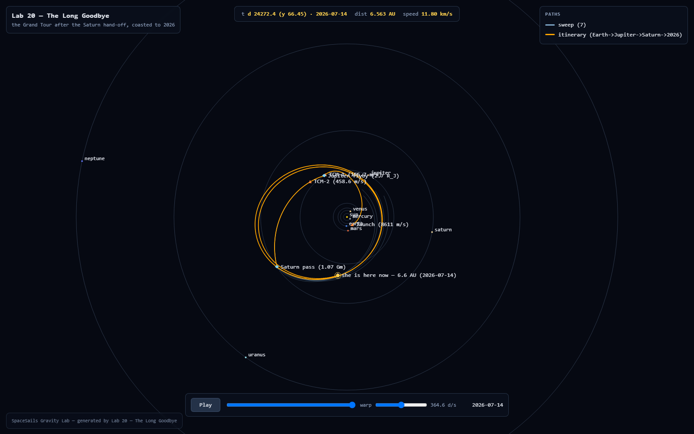

# Lesson 20 — The Long Goodbye

*Lesson 19 flew our rails-universe Grand Tour and stopped at the Saturn closest pass. The real Voyager 2 never stopped — she rode the same crank on to Uranus (1986) and Neptune (1989), and mid-2026 she is about 139 AU from the sun, still outbound. This lesson asks the two questions lesson 19 left on the table: what happens to OUR probe after the Saturn hand-off if she just coasts, and can any affordable nudge put her on a second crank to Uranus in this sky? Then it flies the answer forward to a fixed present date and reads her position — the way the Deep Space Network still reads the real one's.*

```bash
dotnet run --project labs/20-the-long-goodbye -c Release
```

(The probe first re-flies lesson 19's whole window scan and b-plane sweep to stand on the exact hand-off state — give it about a minute.)

## Seeing it

Add `--viz` to get the same numbers *plus* a picture of the whole tour, from launch to where she is now:

```bash
dotnet run --project labs/20-the-long-goodbye -c Release -- --viz
```

This writes a single self-contained `labviz/lab20-the-long-goodbye.html` (no external requests) and opens it in your browser — drawn in the game's own visual language, with the sun, all eight planet rails (Uranus and Neptune matter now), drag to pan, wheel to zoom, and a scrubber that walks time from 1977 to 2026. What you see:

- The **flown itinerary** in orange — launch off Earth's ring, the swing behind Jupiter, the Saturn pass, and the long ballistic coast that follows — with a ghost ship the scrubber animates along the arc.
- The **TCM-3 fan** from Section B (`sweep` group, faded blue-gray): the pre-Saturn re-aims that try, and fail, to find a second crank. Toggle it off in the legend.
- Markers for every burn (launch, TCM-1, TCM-2, with Δv), the Jupiter flyby, the Saturn pass, and the finale — an `event` marker at her present position labelled with her computed heliocentric distance and the date `2026-07-14`.

Add `--viz-no-open` to write the file without launching a browser. The stdout tables are untouched by `--viz` — the printed numbers stay sacred.

The readout and clock show **calendar dates**, anchored (exactly as lesson 19) so the flown departure lands on Voyager 2's real launch instant, 1977-08-20 14:29 UTC — a display choice, plainly labeled: the rails' phases are fictional, so this is an anchor for the story, not a claim about 1977's sky. Scrub to the end and watch our probe drift back inward while the real Voyager 2, on the same calendar, is four times farther out and still leaving.


*The finale, framed to the whole outer system: launch → Jupiter → Saturn in orange, then the ballistic coast that curls back inside 10 AU, with the ghost ship parked at her 2026-07-14 position (6.6 AU) and the readout confirming it. Neptune and Uranus sit on their rings far outside our probe's reach — the empty sky Section B measures.*

## Why this lesson exists

Lesson 19 proved the crank is real and priced the first flyby honestly. But it stopped at Saturn and left the sequel unwritten: gravity assist is only a *chain* if the next planet is standing where the slung arc arrives. The real Grand Tour was not made possible by a bigger rocket or a cleverer flyby — it was made possible by a once-per-175-years alignment of the four giants. This lesson makes that point quantitatively, in our own rails universe, by trying every affordable second crank and measuring that none of them lands. Then it does the thing the owner asked for: **track the tour to where the probe is now.** Curtis ch. 8 (patched-conic assists) and ch. 6 (transfers) are the reference; the integrator is the real deterministic engine the game flies.

## The standard-textbook take

A gravity-assist chain is a sequence of patched-conic flybys, each rotating the hyperbolic excess velocity inside a planet's sphere of influence and adding the planet's heliocentric velocity back on the way out. The chain closes only when the outgoing arc's aphelion reaches the next planet's orbit **and** that planet is near the crossing at the right time. Voyager 2's 1977 launch caught the ~175-year four-planet window; miss it and the same launch energy buys one flyby, not four.

## What the game simplifies away

Circular coplanar rails (no inclination, no eccentricity), instantaneous exact burns, planets that cannot recoil (lesson 9's ledger hole), and — the crux here — **fictional orbital phases**. Our giants are not in 1977's positions, so this lesson's "is there a window?" answer is honest about *our* sky, not history's. The comparison to the real Voyager 2 is always labeled as the real world's numbers.

## The numerical experiment

### The hand-off, reproduced

The probe re-flies lesson 19's Section C in full — same body table, same 20-year departure grid, same four leg lengths, same b-plane sweep — so Lab 20 stands on the exact state Lab 19 handed off, not on hand-copied numbers:

```
window scan best: depart day 6413, Earth->Jupiter leg 3.4 yr
b-plane sweep best aim offset -1485 Mm; ballistic Saturn approach 57.86 Gm at day 9499
flown TCMs: launch 8611 m/s, TCM-1 155.7 m/s, TCM-2 458.6 m/s
Saturn hand-off: 1.07 Gm from Saturn, day 9499, closing 9.02 km/s relative
reproduced lesson 19 winner (day 6413 / -1485 Mm / 1.07 Gm at day 9499): YES
```

### A — the hand-off: fly THROUGH the pass, zero burn, measure the sign

The hand-off arc is already ballistic (no burn since TCM-2). Fly it straight through the Saturn closest pass and read the solar ledger on each side, well clear of Saturn's well. **Don't assume escape — measure it.**

```
pre-Saturn  specific energy (Sun frame, 120 d before CA): -54773425 J/kg  (negative = bound)
post-Saturn specific energy (Sun frame, 120 d after  CA): -63165023 J/kg  (negative = still bound)
|v_inf| vs Saturn in 3.95 km/s, out 3.86 km/s (conserved to 2 %); turning angle 108.4 deg
pass distance 1.07 Gm = 0.016 Saturn Hill radii (a close pass -> moderate crank)
verdict: the zero-burn arc stays BOUND: post-Saturn apoapsis 10.4 AU (Uranus sits at 19.2 AU, Neptune 30.0 AU)
```

The surprise is the sign. This is a close, slow pass (|v_inf| only ~3.9 km/s against Saturn's ~9.6 km/s of orbital motion), and a full 108° turn of that slow v_inf points it *backward* relative to Saturn's motion — so the flyby **brakes** her: energy drops from −54.8 to −63.2 MJ/kg. |v_inf| is conserved in Saturn's frame to 2% (the change lives only in the Sun frame, exactly lesson 19's law). The zero-burn arc does not escape; it settles into a bound ellipse reaching only 10.4 AU, well short of Uranus's 19.2. There is no free ride to the ice giants here.

### B — the second crank, if the sky allows

The rare-opportunity question. A TCM-3 applied at the hand-off (day ~7805, more than four years before Saturn) re-aims the Saturn b-plane; like lesson 19's sweep, the flyby is a lever, so a few hundred m/s here moves the pass by Gm and re-points the whole post-Saturn leg. For every aim under a 600 m/s budget, measure the Saturn pass, the post-Saturn reach, and — only where the reach actually gets to Uranus's orbit — the Uranus closest approach over a capped 40-year coast. A hit inside 3 Uranus Hill radii would be a genuine intercept.

```
Uranus Hill radius 70.1 Gm; intercept gate = 3 Hill = 210.4 Gm (1.41 AU).
   TCM-3 aim  dv (m/s)   Saturn pass    post-Sat reach    Uranus closest
     -800 Mm        30       0.06 Gm           escapes         4232.1 Gm
     -600 Mm        28       0.04 Gm           22.0 AU         4232.1 Gm
     -400 Mm        26       0.02 Gm            9.7 AU       n/a (short)
     -200 Mm        20       0.04 Gm           escapes         4232.1 Gm
        0 Mm         7       0.48 Gm           11.1 AU       n/a (short)
      200 Mm         5       0.55 Gm           10.8 AU       n/a (short)
      400 Mm         4       0.63 Gm           10.7 AU       n/a (short)
      600 Mm         2       0.72 Gm           10.5 AU       n/a (short)
      800 Mm         1       0.81 Gm           10.4 AU       n/a (short)
     1200 Mm         3       0.99 Gm           10.1 AU       n/a (short)
     1600 Mm         6       1.19 Gm           10.0 AU       n/a (short)
     2000 Mm        14       1.78 Gm            9.7 AU       n/a (short)
```

Read the two ends against each other. Aim *closer* to Saturn (negative offsets, tightening the pass to 0.02–0.06 Gm) and the harder crank does throw the arc out past 22 AU or even to escape — the energy is there. But those arcs miss Uranus by **4,232 Gm** (~28 AU), twenty times the intercept gate, because Uranus is nowhere near the crossing. Aim *farther* and the arc stays a tame ~10 AU ellipse. There is no offset that both reaches Uranus's orbit and finds Uranus there.

**No Uranus window.** That is the whole lesson. A flyby can bend a trajectory as hard as you can afford; it cannot summon a planet to the bend. The real Voyager's four-in-a-row was the mission — not the launch vehicle, not the crank. Without it, our Grand Tour is one flyby long. (When a window *does* exist, the probe chains the same question onward to Neptune; here it never gets the chance.)

### C — the long goodbye

Coast the best arc (Section A's zero-burn pass, since no affordable second crank existed) ballistically to a **fixed** present — `2026-07-14`, hard-coded, never `DateTime.Now`, because determinism is the brand. The calendar maps through lesson 19's anchor (launch = 1977-08-20 14:29 UTC).

```
flying: Section A's zero-burn Saturn pass (no affordable second crank existed)

                   heliocentric dist         speed  years since launch
our probe                     6.6 AU    11.89 km/s             48.9 yr
real Voyager 2               ~139 AU    ~15.3 km/s              ~49 yr   <- the real world's numbers, not ours
```

Forty-nine years on, our probe is **6.6 AU from the sun and drifting back inward** — she reached her 10.4 AU aphelion and is falling again, a permanent captive of the inner-outer boundary. The real Voyager 2 is twenty times farther, still climbing, still leaving, because three more giants lined up to hand her along. Same physics; a different sky. (The ~139 AU / ~15.3 km/s figures are the real world's, cross-checked against NASA's Voyager status pages in 2026 — not our rails.)

### The calendar, honestly

The 1977 anchor is a presentation choice, not a claim: our rails' phases are fictional, so nothing about our probe's flight matches the real 1977 sky. What the anchor buys is a human-readable clock — you can scrub the viz and watch our slower, cheaper tour fall behind the calendar the real mission kept.

## Break it yourself

The probe ends by breaking its own computation three ways; here they are to reproduce and reason about.

```
1. Lever: the SAME 1.6 Gm Saturn re-aim costs 6 m/s applied at the hand-off (Saturn-1695d),
   but 202 m/s applied at Saturn-30d — 36.2x more, because the lever arm collapsed. Aim early.
2. Double dt: Saturn pass 0.800 Gm at 3600 s vs 0.825 Gm at 7200 s (3.2 % shift); post-Saturn energy -63165023 vs -62991289 J/kg.
   A distant pass forgives a coarse step; move the pass inside a Hill radius and it won't.
3. Stop at Saturn: arriving 9.02 km/s relative, a circular orbit at 1.07 Gm needs 5.94 km/s;
   the braking bill is 3.08 km/s (3082 m/s) — the refund on Jupiter's gift, paid in full. Flyby missions never do.
```

1. **Move TCM-3 closer to Saturn.** The same aim costs 36× more propellant applied 30 days out than applied at the hand-off — the flyby lever's arm is *time*, and it collapses as you approach. This is why real navigators aim early and often, and why a late correction is a budget emergency.
2. **Double the step through the pass.** At a distant 0.8 Gm pass the coarse step only shifts the closest approach 3%; tighten the pass inside a Hill radius (Section B's −400 Mm row grazes at 0.02 Gm) and the same coarsening lies badly — the point-mass model and the step size fail together, exactly as lesson 19's §B floor warns.
3. **Brake into Saturn orbit and price the bill.** Stopping costs 3.08 km/s of braking — the refund on Jupiter's donated energy. Voyager never paid it because she never stopped; that is precisely why flyby missions ride the crank for free.

## QA gates (engine-internal)

See the xUnit tests in `tests/SpaceSails.Core.Tests/Lab20LongGoodbyeTests.cs` (G1–G3). They reconstruct lesson 19's flown winner from its known parameters (no full scan, so the file runs in seconds) and assert:

- **G1. Determinism.** The full reconstruction + 49-year coast produces a byte-identical present state on two independent runs.
- **G2. Post-Saturn energy sign.** Recomputed (not parsed from stdout), the solar specific energy is bound on *both* sides of the zero-burn Saturn pass, and the arc's aphelion falls short of Uranus's orbit — Section A's verdict.
- **G3. The flown Saturn pass.** The reconstructed hand-off matches lesson 19's winner: 1.07 Gm at day 9499, within tolerance.

## Real-Voyager anchors (our ephemeris vs. history)

Our circular-rail ephemeris is not the real solar system's. Numbers are illustrative of the geometry the game flies.

| Event / quantity        | Real Voyager 2                    | Our probe (game rails)        | Note |
|-------------------------|-----------------------------------|-------------------------------|------|
| Uranus flyby            | 24 Jan 1986                      | none — no window in our sky   | fictional phases (this lesson) |
| Neptune flyby           | 25 Aug 1989                      | none                          | fictional phases |
| Distance in mid-2026    | ~139 AU                          | 6.6 AU (bound, falling back)  | ours never left the inner-outer boundary |
| Speed in mid-2026       | ~15.3 km/s                       | 11.89 km/s                    | ours lost energy braking at Saturn |
| Post-Saturn verdict     | escaped, chained to two giants    | bound, apoapsis 10.4 AU       | the alignment is the difference |
| Grand-Tour alignment    | ~175 y cycle, caught in 1977      | absent in our grid            | game phasing differs |

Sources: NASA Science Voyager pages and JPL Voyager mission status (cross-checked 2026). The real numbers are labeled as the real world's throughout; ours come only from the integrator.

Every number above came from running the probe. Rerun after edits.
