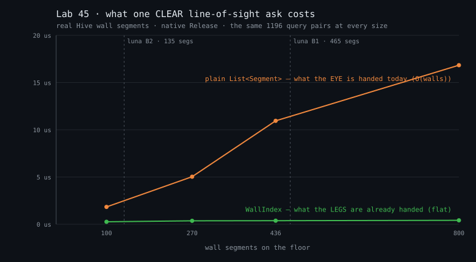

# Lab 45 — What a frame costs

*Standard performance-engineering territory, like Lab 10 — nothing fictional in this lesson. The
"textbook" it argues with is an owner's own eyes, quoted below, and the answer it comes back with
is not the one the eyes proposed.*

## The idea

> Owner, 2026-08-12 (#852): *"performance studies could use a Lab-test to get some numbers?
> Especially, the guard seems to move somehow much more heavily than the reevers who we can have so
> many on the screen without slowdown. So what do you think, a lab about performance with guards,
> reevers and furniture / walls :-D"*

The issue put a hypothesis on the table, and it is a good one:

> guards are O(walls) per guard per frame because of HasLineOfSight sweeps; Reevers are O(1) per
> body.

Half of that turns out to be exactly right, and it is still not the answer to the owner's question.
That gap is what this lab is for.

## Run it

```bash
dotnet run --project labs/45-what-a-frame-costs -c Release -- --frames 1800
dotnet run --project labs/45-what-a-frame-costs -c Release -- --scan    # every floor of every site
dotnet run --project labs/45-what-a-frame-costs -c Release -- --svg labs/45-what-a-frame-costs/sightline-cost.svg
```

Every number below is from a single run on **this dev machine — 12 logical CPUs, Windows 11
(10.0.26200), x64, .NET 10.0.9, native Release console, no renderer, no browser** — pasted verbatim.
1800 frames per measurement at dt = 1/60 s, so each row is 30 simulated seconds of the thing it
names. **One 60 fps frame is 16.67 ms**, and that is the yardstick every "% frame" column uses.

## What is being timed, and what is not

The client keeps **two views of the same stone** and hands them to different callers:

| view | what it is | who is handed it |
|---|---|---|
| `_deckPlan.CollisionField` | `SurfaceCollision.WallIndex` — #448's coarse uniform grid | everything that **walks**: the captain's boots, `ReeverChase.Step`, the guard's stride |
| `SightBlockers()` | a plain `List<Segment>`, cleared and refilled **every frame** from `CollisionSegments` plus whichever doors are shut | everything that **looks**: `PatrolBeat.SightingFor`, `Heard`, `Notices` |

That split is the whole design of this lab. A bench that flattened the two into one segment list
would be measuring a game nobody ships.

`WalkTheRound` and `SpendTheStride` are private methods of the `Map` Blazor component and cannot be
driven headlessly, so `GuardBody.cs` **transcribes** the loop — and every line of it that costs
anything is a call into the same Core/Client code the component calls (`AutoWalk.Plan` over
`PatrolBeat.LatticeFor`, up to 8 × `SurfaceCollision.Slide` at `Gait.Person`, then `SightingFor`,
`Heard` and `Notices`). What is left out is every branch that does no arithmetic — the escort, the
cubicle knock, the bench hold, the walk-up — so the transcription is **cheaper** than the real
round, never dearer. Anything this lab finds expensive is a floor under the real bill.

## The floors

```
floor         segs  locked  stops  standable  round?  what it is
luna B1        465       5      7     107966      NO  THE HEAVY WORLD — the #834 offices
luna B2        135      11      8      14817     yes  THE LIGHT WORLD — no frontage
```

**The first finding is in that last column, and it reframes the issue.** #852 asked for "a real
generated B1/B2 (the post-#834 world, ~436 wall segments)". B1 really is the heavy floor — 465
segments on luna, and 460–480 on every site that has a park block (`--scan`; Enceladus, which has
none, carries 202) — because #834's frontage, #759's glazing, the desks, the cubicles and the
park's own raised beds are all laid by Core into `floor.Walls`. And
B1 is **the one floor of every site that `PatrolBeat.IsPatrolled` says NO to**: the round stops
below the bar, and the bar is B1. *The furniture and the guards have never yet stood on the same
floor.* Every "heavy world" guard row below is therefore a **what-if** — what a round would cost if
it were ever rostered onto the furnished floor — and it is labelled as one.

(There is no honest way to build a "same floor, furniture switched off" world, because Core lays the
furniture into the same wall list as the walls. So the comparison is two real floors, and
**Section B** is the clean causal test that varies the wall count and nothing else.)

## Section A1 — the Reevers

```
floor         segs     N   ms/frame  us/reever  on the stone  % frame
luna B1        465    10     0.0009       0.09         10 %    0.01%
luna B1        465    50     0.0046       0.09          2 %    0.03%
luna B1        465   200     0.0225       0.11          1 %    0.13%
luna B2        135    10     0.0011       0.11         10 %    0.01%
luna B2        135    50     0.0052       0.10          2 %    0.03%
luna B2        135   200     0.0223       0.11          1 %    0.13%
```

**Flat in N and flat in walls.** 200 Old Ones cost 0.0225 ms on the 465-segment floor and 0.0223 ms
on the 135-segment floor — a difference well inside the run-to-run spread (four full runs of this
lab put the B1 200-Reever row at 0.0225, 0.0263, 0.0314 and 0.0339 ms). Per body it is **0.09–0.11 µs**, and it
does not care how much stone the floor carries, because `ReeverChase.Step` slides against the
`WallIndex` and the index only measures the walls the body is actually near. The issue's "Reevers
are O(1) per body" is **confirmed, and the reason is #448, not luck.**

The one thing that does move a Reever's price is the `on the stone` column — the share of steps the
direct run spends flat against a wall, where the handrail takes over and spends **two further
`Slide` calls**. It is 10% at N=10 and 1% at N=200, because `Spread` puts ten bodies in ten
different corners and two hundred bodies mostly in open corridor. It is a fact about corridors, not
about wall counts.

## Section A2/A3 — the guards

```
A2 · captain AT THE CAR (the round comes to him — sweeps happen)
floor         segs     N   legs ms    eye ms sight[] ms  whole ms  sweeps/fr  % frame
luna B1        465     1    0.0105   -0.0001     0.0011    0.0039       0.00    0.02%
luna B1        465     2    0.0060   -0.0001     0.0011    0.0063       0.00    0.04%
luna B1        465     4    0.0060    0.0121     0.0011    0.0191       1.34    0.11%
luna B1        465     8    0.0148    0.0260     0.0011    0.0415       3.05    0.25%
luna B2        135     1    0.0024   -0.0003     0.0005    0.0028       0.00    0.02%
luna B2        135     2    0.0060   -0.0009     0.0004    0.0051       0.00    0.03%
luna B2        135     4    0.0098    0.0056     0.0004    0.0144       1.23    0.09%
luna B2        135     8    0.0179    0.0059     0.0003    0.0232       2.25    0.14%

A3 · captain WALKED OFF (out of eyeshot — the range test rejects before the sweep)
floor         segs     N   legs ms    eye ms sight[] ms  whole ms  sweeps/fr  % frame
luna B1        465     1    0.0027   -0.0001     0.0011    0.0038       0.00    0.02%
luna B1        465     2    0.0047    0.0001     0.0011    0.0060       0.00    0.04%
luna B1        465     4    0.0058   -0.0001     0.0011    0.0072       0.00    0.04%
luna B1        465     8    0.0144    0.0003     0.0012    0.0181       0.00    0.11%
luna B2        135     1    0.0024    0.0001     0.0004    0.0031       0.00    0.02%
luna B2        135     2    0.0048   -0.0000     0.0004    0.0052       0.00    0.03%
luna B2        135     4    0.0114    0.0016     0.0004    0.0118       0.00    0.07%
luna B2        135     8    0.0176    0.0025     0.0004    0.0212       0.00    0.13%
```

Read the columns first. `legs` is the round walked and nothing else. `eye` is taken **by
difference** — the identical walking round timed with the three sightline asks and without them —
because every predicate range-checks *before* it sweeps, so a bench that froze a guard at his stop
would price a configuration the round never holds. `sight[]` is `SightBlockers()` rebuilding its
buffer, once a frame, whether or not anybody looks. `sweeps/fr` is how many full wall sweeps the
three asks actually ran, replayed untimed over the identical walk. A negative `eye` is the
difference method's noise floor (±0.002 ms) reported honestly: **where `sweeps/fr` is 0.00, the eye
is unmeasurable, and that is the point of the row.**

Three things fall out.

**1. The owner is reading a real ratio.** A guard on the heavy floor with the captain in front of
him costs `0.0415 / 8 = 5.2 µs`; a Reever costs `0.11 µs`. **A guard is ~47× a Reever, per body,
per frame.** On the light floor it is 2.9 µs against 0.11 — ~26×. Even with the captain nowhere
near (A3, zero sweeps), a guard is 2.3 µs against a Reever's 0.11 — still **~21×**. He is not
imagining it.

**2. Half that ratio is the eye, and the eye's whole bill is the un-indexed list.** On B1 at N=8,
`eye` is 0.0260 ms of a 0.0415 ms guard — **63% of the round's per-frame cost, on 3.05 sweeps per
frame between eight men.** Three sweeps costing 26 µs is 8.5 µs a sweep, which is exactly what
Section B independently bills a clear sweep of ~436 segments (10.9 µs) once you allow that some of
them hit a wall and exit early. The two sections corroborate each other, which is the only reason
either is worth quoting.

**3. …and the other half is not the eye at all.** In A3, with the captain 204 du away and *not one
sweep run*, eight guards still cost 0.0181 ms against two hundred Reevers' 0.0225. That is the
stride's eight `Slide` sub-steps and, amortised into it, `AutoWalk.Plan` — Section C.

**The `sight[]` column is small and it is real.** 0.0011 ms on the 465-segment floor against 0.0004
on the 135-segment one: a per-frame O(walls) copy that happens *whether or not anybody is looking at
anything*. It is 2.7× the light floor's, in roughly the ratio of the wall counts. It is the one cost
in this entire lab that furniture imposes unconditionally.

## Section B — the sightline, isolated

This is the section that answers "does stone cost anything", and it had to be built twice.

`HasLineOfSight` returns the instant it finds a crossing, so a **blocked** ask costs "how far down
the list the blocker happened to be filed" — generator order, not wall count. The first draft of
this table printed a 436-wall floor as *cheaper* than a 270-wall one for exactly that reason. A
**clear** ask has no early exit: it reads every segment, every time. The four wall lists are nested
prefixes of one pool of real Hive stone, so a query clear against the 800-wall pool is clear against
all four sizes — that column is the same question asked of four buildings.

```
2000 query pairs drawn from luna B1's reachable wash, each ≤ 30 du (the eye's reach);
1196 of them are CLEAR against all 800 walls and therefore sweep the whole list at every size.

 segments | CLEAR sightline: ns/ask  ns/segment  index ns  speedup | as asked in play: ns/ask  index ns
      100 |                  1830.3       18.30     255.6     7.2x |                   1589.9     269.2
      270 |                  5033.9       18.64     358.3    14.0x |                   4350.1     367.4
      436 |                 10946.8       25.11     373.8    29.3x |                   7595.4     380.2
      800 |                 16841.2       21.05     411.8    40.9x |                  11242.1     368.9
```



**The hypothesis is confirmed, exactly and quantitatively: the sightline is strictly O(walls), at
~18–25 ns a segment.** Eight times the stone, nine times the cost. And the same query against the
**same walls filed into the `WallIndex` the same `DeckPlan` already carries** goes from 256 ns to
412 ns across that whole range — **1.6× for 8× the walls**, i.e. flat. The index is not a
hypothetical optimisation to be written; it exists, it is built on every deck weld, and the eye is
simply not handed it.

What that is worth per frame, at the ceiling the eye can reach — three sweeps × N guards, every
sightline clear, which is the open-corridor case where a guard is legible:

```
 segments  1 guard ms         2         4         8   (plain list)
      100      0.0070    0.0139    0.0279    0.0558
      270      0.0180    0.0359    0.0718    0.1436
      436      0.0301    0.0601    0.1202    0.2405
      800      0.0547    0.1093    0.2186    0.4372
```

At `PatrolBeat.MostOnAFloor` = 2, on the heaviest floor the game builds, with both men in clear
sight of the captain, the eye's absolute worst case is **0.060 ms — 0.36% of a 60 fps frame.**

## Section C — the A\* spike

```
floor         legs   best ms  median ms  WORST ms worst = % of a frame  lattice cells  worst leg
luna B1          7     0.089      1.611     6.425                38.6%          29002  the far room off x-103 → the mouth at x…
luna B2          8     0.189      2.233     5.475                32.9%          29002  the far room off x-103 → the mouth at x…

floor         plans/min/guard  sim minutes
luna B1                   2.0            5
luna B2                   2.2            5
```

**Here is the only number in the whole lab that can eat a frame.** A single `AutoWalk.Plan` over
`PatrolBeat.LatticeFor` costs a **median 1.6–2.2 ms and a worst case 5.5–6.4 ms — 33–39% of one
whole 60 fps frame — and it is spent inside one frame, on arrival at a stop.** The round asks for
about **two of them per minute per guard**, so with the shipping maximum of two guards a floor
serves up roughly four of these a minute.

And that is the number **native**. This game ships to WASM, where this repo's own note is "Debug
WASM ≈ 100× slower than native" and even Release WASM is a materially slower environment. A 6.4 ms
plan does not need much of a multiplier before it is a dropped frame the player can see — and it
lands *on the frame a guard reaches a stop*, which is a frame the player is often looking at him.

Note what `PatrolBeat.LatticeFor` is already doing for us: the lattice is the **leg's** box, not the
floor's, and it is still 29,002 cells. #804's own doc comment says a floor-sized lattice at
`DeckReachability.DefaultStep` is a third of a million cells and "would hitch the frame in WASM". It
was right; it just did not go far enough.

## Section D — the draw side: SKIPPED, and why

#852 asked for renderer time against drawn wall/fixture count, to give #841's viewport culling its
number. **This lab does not have that number and did not invent one.**

The renderer is Blazor plus a 2D canvas behind JS interop: there is no headless path to it and it
carries no internal frame counter to read. The only remaining road is a browser, and this repo's
standing law is that a timing taken from an MCP-driven tab is **invalid** — the tab is
`document.hidden`, so rAF is throttled and timers are clamped. A number obtained that way would have
to be disowned in the same paragraph that printed it. So there is no draw-side row here, and #841's
draw-side gate remains open. What this lab *can* say about #841 is the sim-side half, and it says it
below.

## Section E — the harness proves itself

A benchmark that cannot see a change is not measuring anything, so the same bench is run with a
deliberately planted cost:

```
run                                              ms/frame
4 guards on luna B1, as shipped                    0.0289
…with Thread.Sleep(1) per guard per frame         62.1386
…with a 50 us busy-spin per guard per frame        0.2341
```

The sleep shows up as **+62.110 ms/frame** over four guards — 15.5 ms each where 1 ms was asked for,
which is Windows' sleep granularity and not the harness's problem; what is on trial here is
**detection**, and a 2000× signal is detected. The busy-spin is the sharper control because its
duration is known: 50.0 µs planted, **51.3 µs measured**, per guard per frame. The harness resolves
a planted cost 7× the size of the thing it is measuring, to within 3%.

**Two measurement bugs this lab shipped and then caught**, both of which would have produced a
confident, wrong README:

- **Tiered JIT.** The first draft printed a 100-segment list as **ten times dearer per segment** than
  an 800-segment one, and a guard's eye at 17× what the same sweep bills in Section B. Both were
  tier-0 code being timed: .NET promotes a method after ~30 calls plus a timer, and a warm-up of
  thirty frames × three asks never gets there. `Lab45.csproj` now sets
  `<TieredCompilation>false</TieredCompilation>`, so a method is jitted at full optimisation the
  first time it is called and a row means the same thing whether it is first in the table or last.
- **Early exit.** Described in Section B above. A mixed query set cannot measure O(walls), because
  half of it is measuring where the generator happened to file a blocker.

## VERDICT

**It is the planning, not the sightlines — and at sim level it is very nearly neither.** The
issue's hypothesis is confirmed as *mechanism* and refuted as *diagnosis*: `HasLineOfSight` really
is strictly O(walls) at ~18–25 ns a segment, really is the guard's single largest per-frame line
item (63% of his cost on the heavy floor), and really is the reason a guard prices out at ~47× a
Reever per body — but 47× a very small number is still a very small number. Every steady-state row
in this lab is under 0.4% of a 60 fps frame, and the two floors' Reever rows (0.0225 ms vs 0.0223 ms
for 200 bodies) show that wherever the `WallIndex` is used, wall count does not register at all.
The only measurement here that can miss a frame is `AutoWalk.Plan`: **6.4 ms in one frame, 38.6% of
the budget natively, on the frame a guard arrives at a stop, about twice a minute per guard** — and
this game runs in WASM, where that is the difference between a smooth round and a visible hitch.
**The cheapest fix is nonetheless the sightline one, and it should be done first because it is one
line:** hand `SightBlockers()`'s output — or better, `_deckPlan.CollisionField` itself plus the shut
doors — to the eye instead of a plain `List<Segment>`, and the dominant per-frame term drops **29×**
and stops depending on wall count for good. Then cap or spread `AutoWalk.Plan` (per-leg route cache,
or amortise the A\* across frames), which is the only thing in the table that can cost a frame.
Filed as its own issue rather than smuggled into a lab.

## The #841 gate — does wall/fixture count measurably matter at sim level?

**Measurably yes, in exactly one place, and it is small — and that one place is a bug, not a budget.**

- **Where the `WallIndex` is used (all movement — captain, Reevers, guards' legs): no.** 200 Reevers
  cost 0.0225 ms on the 465-segment floor and 0.0223 ms on the 135-segment floor. 3.4× the stone,
  zero measurable difference.
- **Where it is not (the three sightline asks, and `SightBlockers()`'s own per-frame rebuild):
  yes, linearly.** 465 segments against 135 is 330 more segments at ~20 ns each — about 6.6 µs on every
  clear sweep, which shows up
  as 0.0415 ms vs 0.0232 ms for eight guards in eyeshot (+0.018 ms/frame) and 0.0011 ms vs 0.0004 ms
  for the rebuild alone. The absolute ceiling — two guards, heaviest floor, both sightlines clear —
  is **0.060 ms, 0.36% of a frame.**

So **#841's viewport culling cannot be justified on sim cost**: the sim-side dependence on wall and
fixture count is real, linear, and worth about a third of one percent of a frame at the game's own
limits. If culling is worth doing it has to be justified on **draw** cost, and this lab could not
measure draw cost (Section D). And if the sightline fix above lands, even the third of a percent
goes away — after it, wall count does not appear anywhere in the sim's cost model at all.

## Break it yourself

1. **Already above:** the tiered-JIT and early-exit traps are both sprung and documented. Re-enable
   `<TieredCompilation>` in `Lab45.csproj` and watch Section B's first row go to ~76 ns/segment while
   its last stays at ~21 — a perfectly stable, perfectly reproducible, perfectly wrong table.
2. **On your own:** roster a round onto B1. `PatrolBeat.IsPatrolled` refuses it today, so the
   heavy-world guard rows are a what-if; force `--frames` up and put a real beat on the furnished
   floor to see whether the office frontage does anything to the *legs* as well as the eye.
3. **On your own:** this lab measures native Release. The game ships WASM. Run the same
   `AutoWalk.Plan` bench in a real foreground browser session (never an MCP-driven tab — the timings
   are invalid) and find the multiplier that turns 6.4 ms into a dropped frame.
4. **On your own:** `SightBlockers()` also *allocates* its list every frame, and this repo pays for
   garbage in WASM. Nothing here measures GC pressure; a run with `GC.GetTotalAllocatedBytes` around
   the frame loop would say whether the plain list costs twice.

## See also

- `src/SpaceSails.Core/SurfaceCollision.cs` — `HasLineOfSight`, and `WallIndex` with #448's own
  war story ("Now the shuttle ride is timing out twice") about why the grid exists at all.
- `src/SpaceSails.Client/Pages/Map.Patrol.cs` — `AdvancePatrol`, `WalkTheRound`, `SpendTheStride`:
  the loop `GuardBody.cs` transcribes, and the place `walls` (indexed) and `sight` (not) part ways.
- `src/SpaceSails.Client/Pages/Map.Surface.cs` — `SightBlockers()`, the plain list, rebuilt per frame.
- `src/SpaceSails.Core/PatrolBeat.cs` — `EyesOn`, `SightingFor`, `Notices`, `Heard`, and
  `LatticeFor`'s own doc comment on why a floor-sized lattice "would hitch the frame in WASM".
- `src/SpaceSails.Core/ReeverChase.cs` — the step that costs 0.11 µs and does not care about walls.
- Lab 10 (`labs/10-fast-enough-for-ten-thousand-x`) — the other stopwatch lab, and the same lesson
  about where arithmetic runs mattering more than the arithmetic.
- Lab 44 (`labs/44-a-lab-about-the-lab`) — the other lab that references the *client* on purpose,
  for the same reason: Core's geometry and the client's collision field are not the same object.
