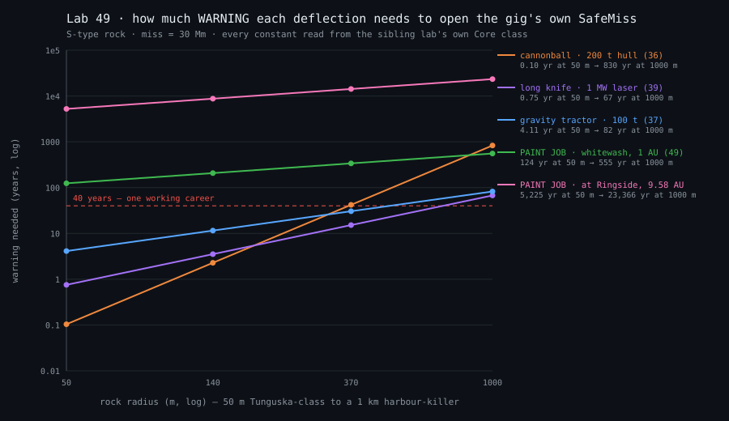
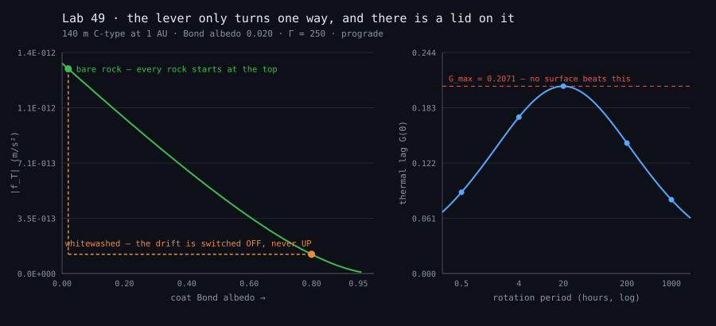

# Lesson 49 — The paint job (albedo / Yarkovsky deflection)

*Five of the six deflections on the owner's playbook need a ship to go and DO something — drill it (lesson
35), hit it (36), tow it (37), land a driver on it (38), boil it from a distance (39). The sixth is already
running, unattended, on every rock in the sky. A body warms in its morning and throws the heat back in its
afternoon; the infrared photons carry momentum; the recoil is a real thrust, and it has been MEASURED — the
asteroid Bennu's orbit is falling 284 metres sunward every year and nothing is pushing it but its own
warmth. The gig idea is to steal the dial: paint the rock, change how much sunlight it drinks, and let the
solar system do the work. The issue that asked for this lab already doubted it —* "probably too slow to be a
gig — the lab exists to prove WHY it's not (an honest negative result the barflies can cite)." *So this lab
gives the technique every advantage it can honestly be given, and then prints what is left.*

```bash
dotnet run --project labs/49-the-paint-job -c Release
dotnet run --project labs/49-the-paint-job -c Release -- --svg labs/49-the-paint-job   # redraw the two plots
```

## Why this lesson exists

Because this is the one deflection where a negative result is worth more than a positive one. The other five
are all engineering problems — bring more mass, bring more power, bring a rig. The paint job is a PHYSICS
problem, and the physics has a ceiling in it: whatever a coat does, it does by changing one number between 0
and 1, and that number was already nearly at its maximum before anybody showed up. A lab that says "too slow"
without a number is a shrug; a lab that says "the best a paint job can EVER do on a 140 m rock at Ringside is
1.7e-14 m/s², which needs a thousand years" is a fact a barfly can quote at the man who suggests it.

And it is the only technique here that can be checked against reality. Nobody has ever kinetically deflected
a city-killer or towed one with gravity, but Yarkovsky drifts have been measured on real asteroids to the
metre per year. So this lab starts with a calibration guard: reproduce the two drifts humanity actually
measured, or nothing below it counts.

## The standard-textbook take

**The diurnal Yarkovsky effect**, in the linearised plane-parallel form (Vokrouhlický 1998/1999; Bottke,
Vokrouhlický, Rubincam & Nesvorný, *The Yarkovsky and YORP Effects*, Annu. Rev. Earth Planet. Sci. 2006). Not
in Curtis — orbital-mechanics textbooks stop at gravity — so this lesson's reference is the planetary-science
literature instead, and it is labelled as such.

- **The radiation factor.** A rock of radius *R* and bulk density *ρ* at heliocentric distance *r* intercepts
  sunlight over π*R*² and weighs (4/3)π*R*³ρ, so the acceleration available if it absorbed every photon is
  **Φ = 3F/(4ρRc)**. Note the **1/R**: a small rock is a great deal of sunlit area per kilogram, and that is
  the entire size story of this lab.
- **The lag.** The rock re-radiates its heat late — after noon, in the direction it has already turned toward
  — so a fraction of Φ ends up pointing ALONG the track rather than away from the Sun. That fraction is
  **G(Θ) = Θ/(1+2Θ+2Θ²)**, where **Θ = Γ√ω/(εσT\*³)** compares how much heat the surface can store against
  how fast it radiates. G is zero at both ends (a surface with no memory throws its heat straight back at the
  Sun; a perfectly conducting one is uniformly warm and throws it everywhere) and peaks at **Θ = 1/√2**, where
  **G = 1/(2+2√2) = 0.2071**.
- **The transverse force.** **f_T = (4/9)·α·Φ·G(Θ)·cos γ**, with α = 1−A the absorbed fraction and γ the
  obliquity. Prograde rotators drift outward, retrograde ones inward.
- **The orbit.** Gauss: on a near-circular orbit **da/dt = 2·f_T/n** — which is the quantity the radar
  astronomers measure, and therefore the quantity the calibration is run on.
- **The along-track leverage.** A steady transverse acceleration held over the warning time opens a miss of
  **1.5·a·T²** — `GravityTractor.ContinuousTowLeverage`, lesson 37's constant, used here directly rather than
  copied, so if lesson 37 ever revises it this lab moves with it.

## What the game adds that the textbook doesn't

**The question the literature does not ask: what does a COAT change, and is that the biggest thing available?**
The papers compute Yarkovsky for a given asteroid; the gig would change it. The answer falls out of one
derivative and it is the whole lesson:

> α·G(Θ(α)) is **strictly increasing in α**. Substituting Θ ∝ α^(−3/4) and differentiating,
> d/dα[α·G] = (Θ/D²)·(0.25 + 2Θ + 3.5Θ²) with D = 1+2Θ+2Θ², which is **positive for every Θ**.

So **brighter is always slower, and the lever only turns one way.** A paint job cannot make a rock drift
faster, at any spin, any regolith, any distance — the very best it can do is switch the drift the rock already
had OFF. And real near-Earth rocks are already dark (Bond albedo 0.02–0.10, α = 0.90–0.98), so "darken it
instead" is worth a couple of per cent. That gives a **ceiling** — (4/9)·α·Φ·G_max — that depends on nothing
tunable, and it is what turns this lab's verdict from a guess into a bound.

The second thing the game adds is an **address**. Ringside Exchange rides Saturn (`scenarios/sol.json`:
`saturn.orbitRadiusM = 1.43353e12`), so the #394 gig happens at **9.58 AU**, where sunlight is 92× thinner —
and the colder surface pushes Θ from 1.57 to 46.7, collapsing the lag on top of the flux loss. The paint job's
worst enemy in this game is not the rock. It is the postcode.

## The numerical experiment

*(All tables below are the probe's own stdout. Change the code and rerun — never hand-edit a table.)*

### A — calibration: the two Yarkovsky drifts humanity has actually measured

```
anchor               R (m)  a (AU)  P_rot (h)   γ (°)      Γ  measured m/yr   model m/yr   ratio
(101955) Bennu         246   1.126       4.30   177.6    310         -284.6       -218.7    0.77
(6489) Golevka         265   2.500       6.03   137.0    100          -95.6        -43.8    0.46

Golevka's thermal inertia is a model fit, not a measurement — sweep it and watch the answer move:
   Γ assumed   model m/yr  ratio to measured
          50        -57.7               0.60
         100        -43.8               0.46
         200        -27.5               0.29
         300        -19.8               0.21
```

**Bennu: 0.77× the measured drift.** That is the tight anchor and it is tight on purpose — OSIRIS-REx went
there, weighed the body, mapped its thermal inertia and photographed its spin, so every input is a
measurement rather than a fit. A linear, plane-parallel, single-Θ, circular-orbit model landing within 23% of
a real radar-measured non-gravitational acceleration on a rubble-shaped body with e = 0.20 is the whole
licence this lab has to print anything else.

**Golevka: 0.21–0.60× depending on an unknown.** Golevka was the FIRST direct Yarkovsky detection (Chesley et
al., *Science* 2003 — a 15 km range anomaly accumulated over twelve years), but nobody has been there: its
density, its thermal inertia and its pole are all fits. So the honest claim is order-of-magnitude across the
plausible range, and the sweep is printed instead of one flattering row being quoted. The guard holds it to a
factor of five, and to a factor of two at its best row.

### B — the natural drift: size, type, spin, distance

```
type                    A_bond      Γ   radius       Θ     G(Θ)    f_T (m/s²)  da/dt (m/yr)
C-type carbonaceous      0.020    250     50 m    1.57   0.1729     3.66E-012        1161.2
C-type carbonaceous      0.020    250    140 m    1.57   0.1729     1.31E-012         414.7
C-type carbonaceous      0.020    250   1000 m    1.57   0.1729     1.83E-013          58.1
S-type stony             0.090    350     50 m    2.33   0.1411     1.44E-012         456.1
S-type stony             0.090    350    140 m    2.33   0.1411     5.14E-013         162.9
S-type stony             0.090    350   1000 m    2.33   0.1411     7.19E-014          22.8
M-type metallic          0.100   1000     50 m    6.71   0.0642     3.30E-013         104.6
M-type metallic          0.100   1000    140 m    6.71   0.0642     1.18E-013          37.4
M-type metallic          0.100   1000   1000 m    6.71   0.0642     1.65E-014           5.2
```

A **nanometre per second squared, divided by a thousand.** The C-type is the best Yarkovsky engine in the
table on both counts — darkest (it drinks the most light) and least dense (it weighs the least per square
metre of sunlight) — and the M-type is the worst on all three, being bright, dense and conductive. The drift
scales exactly as **1/R**.

```
SPIN has an optimum, and it is not 'as fast as possible' — G(Θ) is zero at both ends.
(140 m C-type at 1 AU. Peak lag G = 0.2071 at Θ = 0.7071.)

       P_rot        Θ     G(Θ)  da/dt (m/yr)
       0.5 h    4.453   0.0898         215.5
       2.0 h    2.226   0.1449         347.5
       4.0 h    1.574   0.1729         414.7
      10.0 h    0.996   0.2002         480.1
      20.0 h    0.704   0.2071         496.8
      50.0 h    0.445   0.1947         467.0
     200.0 h    0.223   0.1442         345.8
    1000.0 h    0.100   0.0817         195.9
```

The best Yarkovsky rock is not a fast tumbler and not a slow one. For this surface the optimum is a **20-hour
day**, and the curve is flat-topped — anything from about 10 to 50 hours is within 6% of the peak. You do not
get to choose the rock's spin, so this table exists to set the CEILING the verdict is argued at.

```
DISTANCE, on the same 140 m C-type at its reference spin — and this is where the game lives:

  heliocentric  flux (W/m²)       Θ    f_T (m/s²)  da/dt (m/yr)
       1.00 AU       1361.0    1.57     1.31E-012        414.71
       1.50 AU        604.9    2.89     4.14E-013        240.89
       2.50 AU        217.8    6.22     8.29E-014        103.86
       5.20 AU         50.3   18.67     7.10E-015         26.70
       9.58 AU         14.8   46.70     8.64E-016          8.12
```

Earth to Saturn costs a factor of **1,517** in transverse acceleration, against the **92** the inverse-square
flux loss alone explains. The other 16× is the thermal lag collapsing: a colder surface radiates more slowly,
Θ climbs past the peak, and G falls as 1/Θ on that side. **Sunlight-powered anything is an inner-system tool.**

```
SEASONAL term (the axial-tilt half, run on the orbital period instead of the rotation period),
worst case γ = 90° where sin²γ = 1, on the same 140 m C-type — printed so the omission is measured:

  heliocentric   diurnal f_T  seasonal f_T  seasonal share
       1.00 AU     1.31E-012    -1.19E-013          9.09 %
       2.50 AU     8.29E-014    -3.54E-014         42.73 %
       9.58 AU     8.64E-016    -5.26E-015        609.59 %
```

The seasonal term — the same physics run on the orbital period instead of the rotation period — is a 9%
correction at 1 AU and is ignorable there. At Saturn distance it is the BIGGER of the two, because the
diurnal lag has collapsed and the seasonal thermal wave (metres deep, not centimetres) has not. That is a
genuine finding and it is an escape hatch for the technique, so it gets closed explicitly in section F rather
than left as a footnote.

### C — the lever: what a coat changes, and why it only turns one way

```
(140 m C-type at 1 AU, 4 h spin, full coverage. Natural Bond albedo 0.020.)

  coat A_bond       α       Θ     G(Θ)    f_T (m/s²)  Δ from natural  |Δ|/natural
        0.020   0.980    1.57   0.1729     1.31E-012       0.00E+000        0.000
        0.040   0.960    1.60   0.1717     1.27E-012       3.54E-014        0.027
        0.200   0.800    1.83   0.1610     9.94E-013       3.14E-013        0.240
        0.500   0.500    2.61   0.1316     5.08E-013       8.00E-013        0.612
        0.800   0.200    5.18   0.0796     1.23E-013       1.19E-012        0.906
        0.950   0.050   14.66   0.0319     1.23E-014       1.30E-012        0.991
```

Read the last column. A **black** coat on an already-black rock is worth **2.7%**. A **good white** coat is
worth **90.6%** — and 100% is the wall, because that is the drift the rock had. Painting is a switch, not a
throttle.

```
  coverage    A_eff    Δf_T (m/s²)  share of full coat
      10 %    0.098      1.37E-013              11.6 %
      25 %    0.215      3.39E-013              28.6 %
      50 %    0.410      6.61E-013              55.8 %
      75 %    0.605      9.51E-013              80.3 %
     100 %    0.800      1.19E-012             100.0 %
```

**A correction to the issue's own phrasing.** "Paint one side" does nothing a coverage fraction does not
already describe: the diurnal effect is an average over one rotation, so over a four-hour day *one side is
every side*, and only the surface-averaged albedo survives the average. Half a rock painted buys 56% of a
whole rock painted, and that is all "one side" means here.

```
radial Δa_R = 6.02E-012 m/s² vs along-track Δf_T = 1.19E-012 m/s² — the radial one is 5.1× larger.
   warning  radial drift (m)  Yarkovsky miss (m)    winner
      1 yr         1.91E+003           1.77E+003    radial
     10 yr         1.91E+004           1.77E+005 Yarkovsky
     30 yr         5.73E+004           1.59E+006 Yarkovsky
    100 yr         1.91E+005           1.77E+007 Yarkovsky
```

The honest trap, checked. Painting a rock white also makes it REFLECT more, and that direct
radiation-pressure change is **five times the bigger acceleration**. It still loses, and for a structural
reason rather than a numerical one: the reflection push is **radial**, and a radial force does not secularly
change the semi-major axis at all (Gauss: da/dt has no f_R term). All it changes is the mean-motion rate, so
its along-track drift grows **linearly** in time while the Yarkovsky one grows as **T²**. They cross inside
the second year, and after that it is not close.

### D — the logistics: how much paint, derived

```
An opaque dry film 1.00E-004 m thick at 1400 kg/m³ is 0.140 kg/m². Mass = 4πR²·f·σ.
Cross-check: the 2012 MIT "paintball" back-of-envelope budgeted ≈5 t per round for Apophis (≈0.014 kg/m², a ~10 μm film).

   radius   surface (m²)   opaque coat (t)  paintball coat (t)  vs a 20 t cargo pod
     50 m      3.14E+004               4.4                 0.4         0.2× / 0.02×
    140 m      2.46E+005              34.5                 3.4         1.7× / 0.17×
    370 m      1.72E+006             240.8                24.1        12.0× / 1.20×
   1000 m      1.26E+007            1759.3               175.9        88.0× / 8.80×
```

Derived, not asserted: a pigmented white coating stops showing its substrate at about **100 μm** of dry film,
and a cured pigment-loaded film runs about **1400 kg/m³**, so an opaque coat is **0.14 kg/m²** and the bill is
4π*R*²·σ. The published cross-check comes out an order of magnitude lighter — the 2012 MIT "paintball" entry to
the Move-an-Asteroid competition budgeted roughly 5 t of pigment pellets per round for Apophis, which over a
≈340 m body is **0.014 kg/m²**, a film about 10 μm thick. Both are printed because the verdict does not care
which you believe: a factor of ten in paint mass is a factor of one in warning time, since the coat's mass
does not appear in the physics at all — only its albedo does.

**And this is the surprise of the lab.** The paint job is the CHEAPEST technique on the board by mass.
Thirty-four tonnes clears a 140 m rock's whole surface — less than lesson 36's 200 t old hull, and under twice
its 20 t cargo pod. The bill is not in tonnes. It is in decades.

### E — the crossover: how much warning, honestly

*Two models per row. **REALISTIC**: the C/S/M table at a 4 h spin, prograde, fully whitewashed. **CEILING**:
(4/9)·α·Φ·G_max — the best a paint job could ever do on this rock at this distance, whatever its spin, its
regolith or the chemistry of the coat.*

```
--- at 1.00 AU (flux 1361.0 W/m²) ---
type                     radius    Δf_T real  Δf_T ceiling   yr → 1 R⊕  yr → SafeMiss ceiling yr → SafeMiss
C-type carbonaceous        50 m    3.32E-012     4.39E-012          36             78                    68
C-type carbonaceous       140 m    1.19E-012     1.57E-012          60            130                   113
C-type carbonaceous       370 m    4.48E-013     5.93E-013          98            212                   184
C-type carbonaceous      1000 m    1.66E-013     2.19E-013         160            348                   303
S-type stony               50 m    1.30E-012     2.11E-012          57            124                    97
S-type stony              140 m    4.66E-013     7.55E-013          96            208                   163
S-type stony              370 m    1.76E-013     2.85E-013         156            338                   265
S-type stony             1000 m    6.52E-014     1.06E-013         256            555                   436
M-type metallic            50 m    3.04E-013     1.06E-012         118            257                   137
M-type metallic           140 m    1.08E-013     3.80E-013         198            430                   230
M-type metallic           370 m    4.10E-014     1.44E-013         322            699                   374
M-type metallic          1000 m    1.52E-014     5.32E-014         530          1,150                   614

--- at 9.58 AU (flux 14.8 W/m²) ---
type                     radius    Δf_T real  Δf_T ceiling   yr → 1 R⊕  yr → SafeMiss ceiling yr → SafeMiss
C-type carbonaceous        50 m    2.27E-015     4.78E-014       1,372          2,977                   648
C-type carbonaceous       140 m    8.09E-016     1.71E-014       2,296          4,982                 1,085
C-type carbonaceous       370 m    3.06E-016     6.46E-015       3,732          8,098                 1,764
C-type carbonaceous      1000 m    1.13E-016     2.39E-015       6,135         13,314                 2,899
S-type stony               50 m    7.36E-016     2.30E-014       2,408          5,225                   934
S-type stony              140 m    2.63E-016     8.22E-015       4,029          8,743                 1,563
S-type stony              370 m    9.94E-017     3.11E-015       6,550         14,213                 2,542
S-type stony             1000 m    3.68E-017     1.15E-015      10,768         23,366                 4,178
M-type metallic            50 m    1.30E-016     1.16E-014       5,733         12,441                 1,316
M-type metallic           140 m    4.63E-017     4.14E-015       9,593         20,818                 2,203
M-type metallic           370 m    1.75E-017     1.57E-015      15,596         33,843                 3,581
M-type metallic          1000 m    6.49E-018     5.80E-016      25,640         55,638                 5,886
```

**The boundary, stated exactly, because the brief asked for it and not for a forced negative.** The paint job
is *not* impossible. At 1 AU, a whitewashed **50 m C-type** opens **one Earth radius in 36 years** and the
game's own 30 Mm SafeMiss in **78**. That is a real deflection of a real Tunguska-class rock
by a real mechanism; it is simply not on a human schedule. Every step away from that best case makes it
worse: stony instead of carbonaceous costs 1.6×, 140 m instead of 50 m costs 1.7×, and Saturn costs 38×.

### F — the whole playbook on one axis

```
technique                         warning needed  × the tractor  what it costs
mass driver ON the rock (38)             0.08 yr          0.01×  a landed rig + 62 MW
cannonball, 200 t hull (36)              2.28 yr          0.20×  200 t flown at 6 km/s
long knife, 1 MW laser (39)              3.53 yr          0.31×  1 MW, held continuously
gravity tractor, 100 t (37)                12 yr          1.00×  a tug parked for the duration
cannonball, 20 t pod (36)                  23 yr          1.98×  20 t flown at 6 km/s
PAINT JOB ceiling, 1 AU (49)              163 yr         14.16×  …and a perfect spin
PAINT JOB at 1 AU (49)                    208 yr         18.02×  34.5 t of paint
PAINT JOB at Ringside (49)              8,743 yr        758.94×  34.5 t of paint, 9.58 AU

VERDICT: the slowest technique already shipped in a lab is the gravity tractor at 12 yr. The paint job
at 1 AU is 18× slower than that, and at Ringside — where the gig actually happens — 759× slower.

The one escape hatch, closed: at Saturn distance the DIURNAL lag has collapsed (Θ = 46.7, G = 0.011) and the
SEASONAL term is the bigger of the two. Grant the rock the tilt that maximises it (γ = 90°, sin²γ = 1) and
paint that away too — the best case the seasonal term can offer at Ringside:
  seasonal Δf_T = 3.54E-015 m/s² → 2,383 yr to SafeMiss, 1,098 yr to one Earth radius.
```

Every constant in that table is the sibling lab's own, read from Core rather than retyped: lesson 36's
`KineticImpactor.OldHullMassKg` at `ReferenceClosingSpeed`, lesson 37's `GravityTractor.ReferenceShipMassKg`
at `StandoffFactor`, lesson 38's `RockMassDriver.ReferenceThroughputKgPerSecond` (bisected for the lead at
which the rig's run just fits inside it), lesson 39's `LaserAblation.ReferencePlatformPowerWatts`, and this
lab's own delta against `DeflectionGig.SafeMissMeters`.

And note what the other four rows do NOT have: a distance. A thrown slug, a tug's gravity, a rig on the
surface and a laser all work exactly as well at Saturn as at Earth, because none of them is powered by the
Sun. The paint job is the only technique on the board whose bill depends on where the rock is, and the game's
rock is as far away as the game goes.

The cruellest line in the table is the pair of 20-tonne rows. **The same mass, thrown instead of spread, is
nine times faster**: 20 t of cargo pod flown into the rock at 6 km/s clears it in 23 years; 34.5 t of paint
spread over the whole of it takes 208.


*Every technique on one log axis. The cannonball and the long knife live under the career line for anything
under about 400 m; the paint job at 1 AU (green) is nearly flat and nearly always above it; the paint job at
Ringside (pink) never comes within three decades of anything else on the board.*


*Left: the drift against coat albedo, which is downhill everywhere — a rock starts at the top and paint can
only walk it down, so the dashed gap IS the entire deflection. Right: the thermal lag against rotation period,
with the lid G_max = 0.2071 that no surface can beat, which is what makes the verdict a bound rather than an
estimate.*

## What a barfly can cite

*Plain facts, numbers only. Nothing below is a line of dialogue — the in-world voice is the inspector's job,
and the spots that want authored prose are marked at the end of this section.*

- Painting a rock cannot make it drift faster, only slower. The absorbed fraction is already 0.90–0.98 on
  every C/S/M rock; the most a coat can ever do is take away the drift the rock already had.
- A 140 m C-type at Earth's distance drifts **415 metres per year** on sunlight alone. A full whitewash
  removes **90.6%** of that.
- Removing it opens a miss of 1.5·a·T². To clear the 30 Mm the gig calls safe, that is **130 years** for the
  140 m C-type, **208 years** for a 140 m S-type, **348 years** for a 1 km C-type.
- The smallest rock on the board is the only one with a number a person could live to see: a **50 m** C-type
  whitewashed at 1 AU opens **one Earth radius in 36 years**, the gig's SafeMiss in **78**.
- At Ringside — 9.58 AU — sunlight is 92× thinner and the thermal lag collapses on top of it, for a total
  factor of **1,517**. The canonical 140 m rock there needs **8,743 years**, and **1,085** even at the
  physical ceiling. No rock of any type or size on the grid gets under **648 years**.
- Paint is the cheapest technique by mass: **34.5 tonnes** covers a whole 140 m rock (4.4 t for a 50 m one).
  That is less than the 200 t hull the cannonball throws.
- The same twenty tonnes, thrown instead of spread, is **nine times faster**.
- The technique's best-case spin is a **20-hour day**; faster or slower is worse, and a half-hour tumbler is
  down to 43% of the peak.
- The effect is real and measured: **Bennu's** semi-major axis falls **284.6 m/yr**; **Golevka's** falls about
  **95.6 m/yr**. This lab's model reproduces Bennu to **0.77×**.

*Authored prose goes here (inspector's lane, not this lab's):* (1) **the sales pitch** — the in-world version
of "paint it white and let the Sun do it", which needs to sound plausible enough that a captain considers it;
(2) **the refusal** — how a station engineer says "that's a thousand-year job" without saying "1,085 years";
(3) **a bar exchange** where someone who half-remembers reading about Bennu proposes it and is corrected;
(4) **the salvage angle** — thirty-four tonnes of pigment is real cargo with a real manifest, and someone in
this setting sells it.

## The verdict, and the gig it does not become

**REFUSED under the #395 promotion rule.** The rule is: lab README ships with real numbers → owner picks what
feels like gameplay → a gig variant lane cites the lab's constants. This lab's numbers say there is nothing to
pick. A deflection gig is a thing a captain does inside one session against `DeflectionGig.ImpactBudgetSeconds`
— a six-minute doom clock — and the shortest honest paint job on the entire grid is **648 years** at the place
the gig happens. The gap is not a tuning problem; the nearest technique already certified (lesson 37's gravity
tractor, itself the slow one) is **759× faster** at Ringside.

**The boundary, so the refusal is a measurement and not a mood:** the paint job WORKS, in the sense of opening
an Earth-radius miss, on a rock of **50 m or less**, at **1 AU or nearer**, with **three to four decades** of
warning, and only if the rock is dark, carbonaceous and conveniently spun. Move any one of those and it stops
working. That is a real planetary-defence technique for a real civilisation with a century of notice; it is
not a job, and it is certainly not a job at Saturn.

**What it is good for instead,** if the owner wants the work not wasted: it is the best *piece of true
background physics* in the playbook, because it is the only one with measured asteroids behind it. The natural
Yarkovsky drift is why a rock's predicted path has an error bar that grows, which is a reason a warning can
arrive late — the lore hook is the DETECTION side, not the deflection side. Nothing here needs building for
that; the numbers above are the citation.

## Break it on purpose

1. **Delete the lag.** Replace `ThermalLag(Θ)` with `Θ` and rerun section A: Bennu's predicted drift jumps by
   a factor of 15 and the calibration fails by an order of magnitude. The lag function IS the effect — without
   it you are computing a rock that re-radiates instantly, which is a rock that doesn't drift at all.
2. **Paint it black instead.** Point section C at `BlackPaintBondAlbedo` and rerun: the change is 2.7%, and
   the required warning goes up by **5.8×** (warning ∝ 1/√Δa, so a 34× weaker push is a 5.8× longer wait).
   This is the experiment that proves the lever is one-sided rather than
   the algebra claiming it.
3. **Move the gig inward.** Set the section E distance to 1.0 AU for both blocks and rerun the verdict: the
   accelerations improve by 1,517× and every warning time falls by about **42×** (warning ∝ 1/√a), bringing
   the 50 m C-type comfortably inside a career. The technique is not bad
   physics — it is physics in the wrong postcode, and this is the knob that shows it.
4. **Believe the lighter paint.** Swap `ArealDensityKgPerM2` for `PaintballArealDensityKgPerM2` in section D
   and rerun everything: the paint bill falls 10× and **not one warning time moves**, because the coat's mass
   never enters the physics. A good check that the logistics section is genuinely separate from the verdict.

## The guards, and proving they can fail

`YarkovskyPaintTests` — **18 tests**, in four groups: calibration against the two measured anchors,
monotonicity laws, units sanity, and the verdict with its boundary pinned.

Every tolerance, and why it is that wide:

| guard | tolerance | why |
| --- | --- | --- |
| Bennu drift | ratio ∈ [0.5, 2.0], **and** the 0.77 pinned to ±0.02 | the model is linear, plane-parallel, single-Θ and circular-orbit against a real e = 0.20 rubble-shaped body; a factor of two is the honest physics window, and the pin is what actually has teeth |
| Bennu depends on spin & inertia | > 10% movement | the anti-vacuity fence — a constant-lag model would slip through the factor-of-two window and is flat in both |
| Golevka drift | ratio ∈ [0.2, 5.0] over Γ ∈ [50, 300], best row within 2× | its density, thermal inertia and pole are all fits, so a tight tolerance would be a claim about someone else's model, not about this one |
| README crossover numbers | ±2% | these come from the same code the README was pasted from, so anything looser only buys the freedom to change the model silently |
| Ringside verdict | > 500 years at the ceiling (observed 648) | the number that makes the refusal; stated as a threshold the verdict's prose depends on, so if it is ever crossed the prose is wrong and the test says so |
| paint job is slowest | > 10× the gravity tractor (observed 18×) | the README says "an order of magnitude slower than the slowest technique already certified" — this is that sentence, as an assertion |
| the monotonicity laws | strict inequality, no tolerance | they are exact algebra, not measurements |

**Broken on purpose eight times before shipping, and every one turns guards red:**

| the break | guards that went red |
| --- | --- |
| B1 raw Θ used as the lag | **10** — both anchors, the lid, the ceiling law, the distance law, the crossover, the verdict, the ranking |
| B2 obliquity ignored (cos γ = 1) | **2** — both anchors (the sign flips; Bennu stops falling sunward) |
| B3 Φ scaling *with* radius instead of 1/R | **7** — the two-route units check, the size law, both anchors, the crossover, the verdict, the ranking |
| B4 absorbed fraction α dropped from the thrust | **5** — including `BrighterIsAlwaysSlower`, which is the one that matters: without α the lever turns both ways |
| B5 the diurnal coefficient halved | **4** — both anchors and the two verdict guards |
| B6 leverage made linear in T instead of T² | **2** — the quadratic law and the radial-vs-Yarkovsky crossing |
| B7 heliocentric distance ignored | **7** — the distance law, the heat budget, the units check, both anchors, the crossover, the verdict |
| B8 lag pinned at its MAXIMUM (the tolerance-cheating model) | **7** — including the anti-vacuity fence it was written for, which is the point: the factor-of-two window alone would have let this through |

B8 is the one worth reading twice. A model that simply always used the peak lag lands at 1.10× the Bennu
measurement — comfortably inside a factor-of-two gate and comfortably wrong. That is exactly the failure mode
this house has named before (a guard whose tolerance selects everything), and it is why the calibration ships
with a second test asserting the answer MOVES when the spin and the surface move.

## The framing rule, kept

Standard physics presented as standard: the linearised plane-parallel diurnal Yarkovsky theory
(Vokrouhlický; Bottke et al. 2006), Gauss's da/dt = 2·f_T/n, the diffuse-sphere radiation-pressure
coefficient, and lesson 37's continuous-tow leverage, which this lab calls rather than copies. The measured
anchors (Bennu −284.6 m/yr, Golevka ≈ −95.6 m/yr) are real published measurements and are labelled as the
calibration they are. The C/S/M albedo and thermal-inertia table is representative and marked OWNER-TUNABLE,
anchored on measured bodies (Bennu Γ ≈ 310, Ryugu ≈ 300, Itokawa ≈ 700) — and per the owner's 2026-07-20
ruling there are no rubble piles here, only C, S and M. The paint constants are derived from a stated film
thickness and density and cross-checked against a published back-of-envelope. Where the model is narrow it
says so: no shape model, no rough-surface thermal beaming, no YORP spin-up, no orbital eccentricity, and no
account of what a coat does to the surface's own thermal inertia — all of which would move the *natural*
drift, and none of which can lift the ceiling that decides the verdict, because the ceiling is set by G_max
and α ≤ 1. Every number above came from running the probe.
